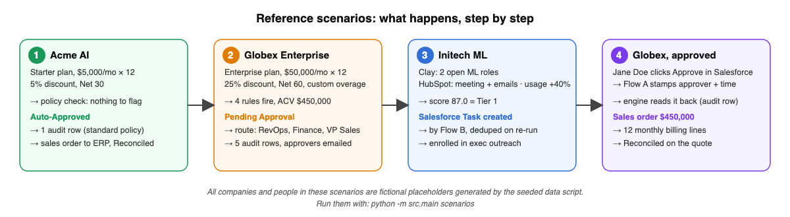
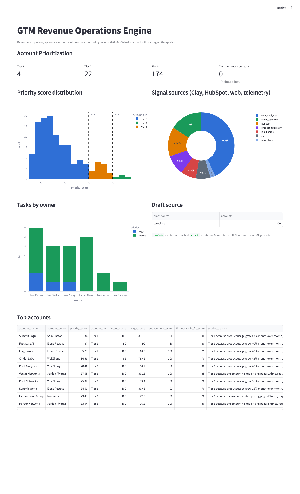

# AI-Native GTM Revenue Operations Engine

[](https://github.com/akhilesh360/gtm-automation-reference/actions/workflows/ci.yml)


A Salesforce-centered reference implementation for CPQ-style pricing governance, discount approvals, signal-based account prioritization, CRM data-quality controls, quote-to-cash handoff, and revenue operations reporting.

Deterministic Python and SQL make every commercial-policy and scoring decision. An optional AI step drafts prose. Salesforce Flow executes CRM actions. Everything runs locally on DuckDB and Streamlit with no credentials, and optionally syncs to a Salesforce org through a deployable SFDX package.

## 60-second walkthrough

https://github.com/user-attachments/assets/31763cfa-b9bf-406b-b4df-b20463a8e5b0

*Press play above (61 seconds, with captions). A copy of the video is also in [docs/media/under_the_hood.mp4](docs/media/under_the_hood.mp4). It shows the architecture, live Clay enrichment, a live HubSpot pull, deterministic scoring, the Salesforce Task created by Flow B, the quote decision written into Salesforce, a human approval flowing to the mock ERP, and the pipeline analytics.*


**Status:** v1 is complete. I tested the seeded scenarios, deployed the Salesforce metadata to a Developer Org, verified the Flow behavior, and confirmed the offline and Salesforce-connected modes. v2 adds a quote-to-cash handoff to a NetSuite-style mock ERP and pipeline funnel analytics, both verified in the same org.

This is a CPQ-style reference implementation using Salesforce custom objects. It demonstrates commercial-policy and quote-governance patterns. It is not a replacement for native Salesforce Revenue Cloud or Salesforce CPQ.

## Contents

- [60-second walkthrough](#60-second-walkthrough)
- [What it does](#what-it-does)
- [Quick start](#quick-start)
- [Reference scenarios](#reference-scenarios)
- [How a quote is decided](#how-a-quote-is-decided)
- [How an account is prioritized](#how-an-account-is-prioritized)
- [Quote-to-cash and pipeline analytics (v2)](#quote-to-cash-and-pipeline-analytics-v2)
- [Screenshots](#screenshots)
- [Repository layout](#repository-layout)
- [Documentation](#documentation)

## What it does

| Module | Flow | Output |
|---|---|---|
| **CPQ-style pricing and approvals** | quote request → validation → pricing (subscription and usage overage) → approval route from `config/policy.yaml` → audit trail → Salesforce sync | `quotes`, `approval_audit`, `Quote__c`, `Approval_Audit__c` |
| **Signal-based account scoring** | accounts, Clay-shaped enrichment, HubSpot-shaped engagement, usage telemetry → deterministic sub-scores → weighted priority → Tier 1/2/3 → `Account_Score__c` → Flow B creates the Salesforce Task; Tier 1 and 2 enrolled in outbound sequences | `account_scores`, `sales_tasks`, `sequence_enrollments`, Salesforce Task |
| **Quote-to-cash** (v2) | human approve/reject in Salesforce → read back with audit row → sales-order payload with billing schedule → NetSuite-style mock ERP → reconciliation written back | `erp_orders`, `Quote__c.ERP_Status__c` |
| **Pipeline analytics and forecasting** (v2) | opportunities with stage history → funnel, bottleneck, days in stage, conversion by tier, weighted forecast and forecast vs actual → Salesforce `Opportunity` sync | Pipeline dashboard tab, `forecast_snapshots` |
| **Data quality and monitoring** | schema validation, dedupe, quote validator, 13 parameterized SQL checks, JSON logs with correlation IDs, retries, integration log | `dq_results`, `integration_log`, CI exit code |
| **Surfaces** | Streamlit (CPQ Operations · Account Prioritization · Pipeline · Data Quality) and FastAPI (`/health`, `/score-account`, `/evaluate-quote`) | local UI, service endpoints |

**Ownership model.** Python owns decisioning; Salesforce Flow owns CRM-native task creation and duplicate prevention; Salesforce is the system of record for human approval decisions. Commercial policy lives in one versioned file, `config/policy.yaml`. Flows contain no thresholds. Clay and HubSpot are upstream signal inputs, never systems of record for pricing or quoting.

## Quick start

```bash
make setup        # python3.11 venv + dependencies
make scenarios    # run the pipeline and print the reference scenarios
make dashboard    # http://localhost:8501
make api          # http://127.0.0.1:8000/docs
make test         # 94 tests, no credentials needed
```

Without `make`:

```bash
python3.11 -m venv .venv && source .venv/bin/activate
pip install -r requirements.txt
python -m src.main scenarios
```

No `.env` is required. A real Salesforce client authenticates with Salesforce credentials or an access token; a mock client supports offline development and testing. To push into a real org, deploy `sfdx/` once (see [docs/salesforce_setup.md](docs/salesforce_setup.md)), log in with `sf org login web -a gtm-dev`, and run with `SF_ENABLED=true`. Set `AI_ENABLED=true` with an API key for AI-assisted drafting. Set `ERP_URL` to hand off to the standalone mock ERP over HTTP, `CLAY_ENABLED` / `HUBSPOT_ENABLED` for live connectors.

## Reference scenarios

| # | Scenario | Input | Result |
|---|---|---|---|
| 1 | **Acme AI** | Starter API Commitment, $5,000/mo × 12, 5% discount, Net 30 | ACV $57,000 → **Auto-Approved**, one `STANDARD_POLICY` audit row, handed to the ERP and reconciled |
| 2 | **Globex Enterprise** | Enterprise Platform, $50,000/mo × 12, 25% discount, Net 60, custom overage rate | ACV $450,000 → **Pending Approval**, route RevOps + Finance + VP Sales, five audit rows |
| 3 | **Initech ML** | Clay hiring signals, HubSpot meeting and emails, 3 pricing visits, 40% MoM usage growth | priority **87.0** → Tier 1 → one Salesforce Task created by Flow B, deduped on re-run |
| 4 | **Globex Enterprise, approved** (v2) | Jane Doe approves in Salesforce | `HUMAN_DECISION` audit row → sales order for $450,000 with a 12-line billing schedule → **Reconciled** on the quote |

> All company and person names in these scenarios (Acme AI, Globex Enterprise, Initech ML, Jane Doe, the account owners) are fictional placeholders produced by the seeded data generator. Domains use the reserved `.example` suffix.



`python -m src.main scenarios` prints all four. [docs/scenario_tests.md](docs/scenario_tests.md) is the walkthrough.

## How a quote is decided

```
quote request
  → quote_validator      structural rules; commitment must match list price unless custom pricing
  → pricing_engine       usage overage (custom rate replaces list rate) → gross → discount → net → ACV
  → approval_rules       thresholds from policy.yaml → status, ordered approvers, reasons
  → audit                one quotes row, ≥ 1 approval_audit rows (auto-approvals included)
  → Salesforce sync      Quote__c + Approval_Audit__c upserted by external ID; human decisions never overwritten
  → Flow A               emails Quote Owner + RevOps mailbox + mapped approver roles, stamps timestamps and approver; no policy math
```

| Rule | Route |
|---|---|
| Discount ≤ 10%, standard terms, ACV < $100K | Auto-approve |
| Discount 10–20% | Sales Manager |
| Discount > 20% | RevOps + Finance |
| ACV ≥ $100K | VP Sales |
| Custom pricing, commitment, or overage rate | RevOps |
| Payment terms other than Net 30 / Annual Prepaid | Finance |

The matrix above is generated from the policy file by `make policy`.

## How an account is prioritized

```
priority = 0.40·intent + 0.30·usage + 0.20·engagement + 0.10·firmographic     (weights in policy.yaml)
Tier 1 ≥ 80 · Tier 2 ≥ 60 · Tier 3 otherwise
```

Each score carries a deterministic `scoring_reason`, for example: *Tier 1 because product usage grew 40% month-over-month, the account visited pricing pages 3 times, requested a demo, is hiring for 2 ML roles, and firmographic fit is high.* With `AI_ENABLED=true`, one Claude call per Tier 1 account drafts a narrative, a task description and an outbound email from those facts. It never changes a number.

## Quote-to-cash and pipeline analytics (v2)

**Quote-to-cash.** A person approves or rejects a pending quote in Salesforce (or via `python -m src.main decide` as a stand-in). Flow A stamps the approver and time. `sync-approval-outcomes` reads the decision back with a `HUMAN_DECISION` audit row. `erp-handoff` builds a sales-order payload with a monthly billing schedule that sums to the net value, sends it to the mock ERP (in-process, or the HTTP service in `erp/mock_server.py`), reconciles the accepted total, and writes the order id and status back to DuckDB and `Quote__c`.

**Pipeline analytics.** Seeded opportunities with stage history feed a funnel, a bottleneck flag on the step with the lowest conversion, median days in stage, and conversion by the account tier at deal creation. Opportunities sync to the standard Salesforce `Opportunity` object with mapped stages.

**Outbound sequences.** Tier 1 accounts are enrolled in an executive-outreach sequence and Tier 2 in standard outbound, one active enrollment per account, with the drafted first touch attached. Re-runs never duplicate. Reply status is derived from signals in this version; a real sequencer would own it.

**Live connectors.** `CLAY_ENABLED=true` registers a secured `POST /webhooks/clay` receiver that normalizes Clay's column aliases and upserts enrichment by domain. `HUBSPOT_ENABLED=true` pulls emails and meetings from the HubSpot CRM API into the same CSV shape the offline path reads. Both are unit-tested offline.

**Research agent.** `python -m src.main research --account-id ACC-00003` runs a bounded tool loop (five read-only tools, six calls max) that writes a brief, talking points and an outbound draft, falling back to a template without a key.

**Salesforce hardening.** Flow A now builds approver recipients from an `Approver_Role__mdt` mapping for the roles named on the quote, and `python -m src.main policy --sfdx` generates a `Commercial_Policy__mdt` record so the org displays the thresholds it never computes.

**Forecasting.** Stage probabilities live in `config/policy.yaml`. Open opportunities are weighted by close month and tier, a dated snapshot is stored on each run, six months of history are reconstructed from stage transitions, and closed months are compared to the forecast that stood at the start of the month. Design notes: [docs/V2_DESIGN.md](docs/V2_DESIGN.md).

## Screenshots

| CPQ Operations | Account Prioritization |
|---|---|
|  |  |

| Pipeline | Data Quality |
|---|---|
|  |  |

## Repository layout

```
config/policy.yaml     single policy authority (thresholds, weights, tiers, SLA)
data/raw/              seeded CSVs: accounts, Clay-shaped enrichment, HubSpot-shaped engagement, signals, usage,
                       products, quote requests, opportunities, stage history
sql/                   DDL, loads, scoring views, parameterized DQ checks, reporting and funnel views (Snowflake-style)
src/cpq/               validator, pricing engine, approval rules, audit persistence
src/scoring/           sub-scores, tiering, explanation, scoring runner
src/ingestion/         schema validation, raw load, HubSpot mapping, Clay webhook adapter, HubSpot API pull
src/salesforce/        client protocol, mock (Flow A/B emulation), real client, sync, task/approval readback, ERP write-back
src/forecasting/       weighted forecast, dated snapshots, historical backfill
src/outbound/          sequence enrollment by tier with dedupe
src/erp/               sales-order payload, NetSuite-style mock client (in-process or HTTP), handoff and reconciliation
src/ai/                optional drafter (one call, template fallback), read-only tools, bounded research agent
src/monitoring/        JSON logging, integration log, DQ runner, alerts
src/main.py            CLI: init-db · load-raw · validate · score · evaluate · draft · research · sync · sync-task-outcomes
                       · sync-approval-outcomes · erp-handoff · forecast · enroll · decide · dq · run-all · scenarios · policy
api/                   FastAPI, three routes
erp/mock_server.py     standalone HTTP mock of the ERP sales-order API
dashboard/app.py       Streamlit: CPQ Operations · Account Prioritization · Pipeline · Data Quality
sfdx/                  deployable metadata: objects, fields, permission set, custom setting, custom metadata, two Flows
tests/                 94 tests incl. exact reproduction of the scenarios and the quote-to-cash path
docs/                  technical design, v2 design, data dictionary, Salesforce mapping and setup, scenario tests,
                       architecture diagram, screenshots, media/ (60-second walkthrough video)
.github/workflows/     CI: lint, seeded data, tests, scenario run
```

## Documentation

- [Technical design](docs/TECHNICAL_DESIGN.md) — architecture, HLD, LLD, decisions
- [v2 design](docs/V2_DESIGN.md) — quote-to-cash handoff, pipeline analytics
- [Data dictionary](docs/data_dictionary.md)
- [Approval matrix](docs/approval_matrix.md) (generated)
- [Salesforce mapping](docs/salesforce_mapping.md) and [setup](docs/salesforce_setup.md)
- [Scenario tests](docs/scenario_tests.md)
- [Changelog](CHANGELOG.md)

## License

MIT
