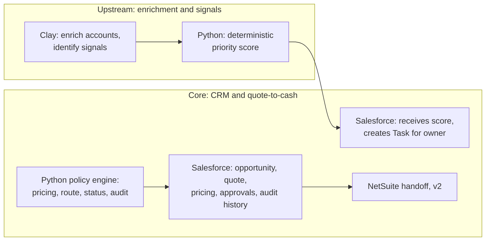
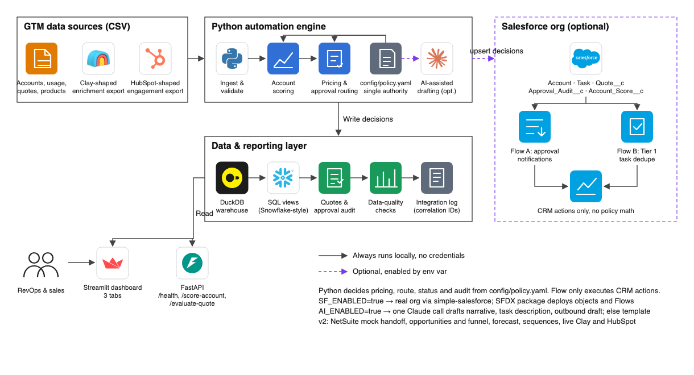
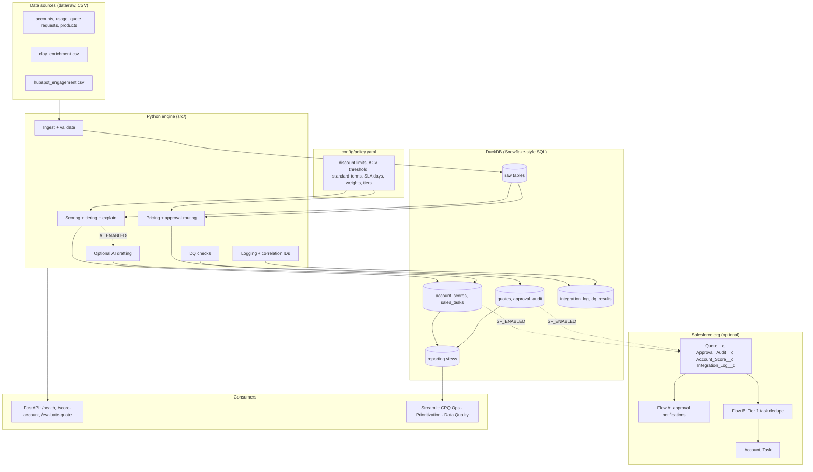
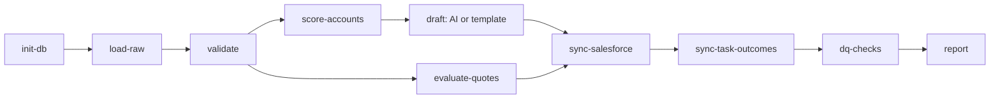
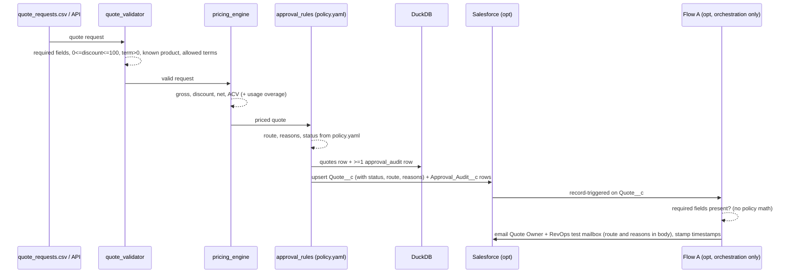
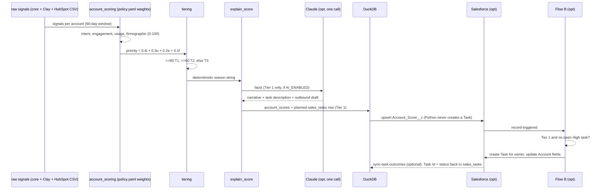
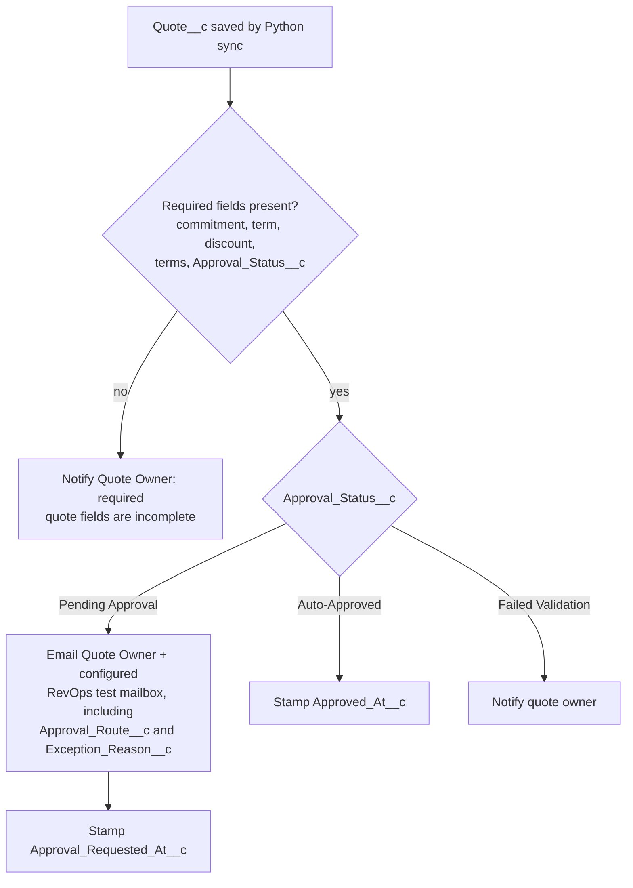
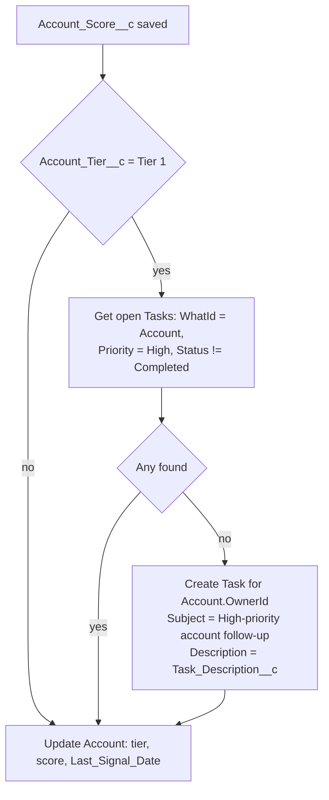

# AI-Native GTM Revenue Operations Engine — Technical Design

**AI-Native GTM Revenue Operations Engine** is a Salesforce-centered reference implementation for CPQ-style pricing governance, discount approvals, signal-based account prioritization, CRM data-quality controls, and revenue operations reporting.

The project uses deterministic Python and SQL logic for commercial policy and account scoring, with optional AI-assisted narrative drafting. It runs locally with DuckDB and Streamlit, and can optionally synchronize selected records to Salesforce through a deployable SFDX metadata package.

---

## Table of contents

1. [Overview and scope](#1-overview-and-scope)
2. [Decisions locked in](#2-decisions-locked-in)
3. [High-level architecture](#3-high-level-architecture)
4. [HLD: end-to-end flows](#4-hld-end-to-end-flows)
5. [Repository structure](#5-repository-structure)
6. [LLD: data model](#6-lld-data-model)
7. [LLD: commercial policy, pricing and approval engine](#7-lld-commercial-policy-pricing-and-approval-engine)
8. [LLD: account scoring and explainability](#8-lld-account-scoring-and-explainability)
9. [LLD: Salesforce integration layer, SFDX metadata, Flows](#9-lld-salesforce-integration-layer-sfdx-metadata-flows)
10. [LLD: optional AI-assisted drafting](#10-lld-optional-ai-assisted-drafting)
11. [LLD: API, dashboard, data quality, monitoring](#11-lld-api-dashboard-data-quality-monitoring)
12. [Demo scenarios](#12-demo-scenarios)
13. [Resume and role alignment](#13-resume-and-role-alignment)
14. [v2 roadmap](#14-v2-roadmap)
15. [Build plan, testing, open questions](#15-build-plan-testing-open-questions)

---

## 1. Overview and scope

**Scope statement.** This is a CPQ-style reference implementation using Salesforce custom objects. It demonstrates commercial-policy and quote-governance patterns. It is not a replacement for native Salesforce Revenue Cloud or Salesforce CPQ, and it does not model the Revenue Cloud catalog, price books, amendments, renewals, orders, assets, billing schedules or subscription lifecycle. The correct claim is: *"I built a Salesforce-centered CPQ-style reference implementation that models pricing, discount governance, approvals, and quote-to-cash controls."*

**v1 builds exactly four modules.**

| Module | What it does | Output |
|---|---|---|
| **1. CPQ-style pricing and approvals** (highest priority) | Quote request → pricing (subscription + usage) → discount / payment-term / ACV validation → approval route → audit trail → Salesforce custom-object sync. The prototype evaluates commercial-policy requirements and routes exceptions. In v1, Salesforce Flow sends approval notifications and records the requested approval state; human approval completion and rejection capture are deferred to v2 | Approval decision, audit rows, `Quote__c` + `Approval_Audit__c` |
| **2. Signal-based account scoring** | Account + intent + usage signals (CSV from Clay-shaped and HubSpot-shaped exports) → deterministic score → Tier 1/2/3 → planned task record → `Account_Score__c` sync → Salesforce Flow B creates the Task | `account_scores`, `sales_tasks` (planned), `Account_Score__c`; Task created by Flow B |
| **3. Data quality and monitoring** | Duplicate domains, missing owners, invalid quotes, Tier 1 without open task, integration log with correlation IDs | `dq_results`, `integration_log`, console alert |
| **4. Streamlit dashboard** | Three tabs: CPQ Operations, Account Prioritization, Data Quality | Local dashboard, no credentials |

### 1.1 System boundaries

Two chains, one boundary. Clay is the upstream enrichment and signal-input layer. Salesforce and the RevOps policy engine are the core quote-to-cash system. Clay never touches pricing, approvals, quotes, finance data or CRM source-of-truth records.

**Core chain (Together's role):**

```
Salesforce CRM data / quote request
→ Python commercial-policy engine
→ Salesforce quote visibility, notification, and task workflow
→ future NetSuite handoff (v2)
```

**Upstream GTM chain (Clay-supported):**

```
Account list → Clay enrichment → firmographic / intent signals → Python priority score → Salesforce Task or outbound action
```



| Clay is responsible for | Clay is never responsible for |
|---|---|
| Company enrichment: employee count, funding stage, industry, technology stack | CPQ pricing |
| Job-posting signals: ML/AI hiring, data-infrastructure hiring | Discounts |
| Website and company research summaries | Approval workflows |
| Intent and buying signals | Quote generation |
| Inputs to account prioritization | Finance data |
| Personalization inputs for outbound | ERP / NetSuite handoff |
| Delivering enriched account data to the pipeline via CSV (v1) or webhook/API (v2) | Source-of-truth CRM records |

Everything in the right-hand column belongs to Salesforce, the RevOps policy engine, and eventually ERP/finance systems.

### 1.2 Source of truth by data domain

| Data domain | System of record in prototype | Reason |
|---|---|---|
| Account and CRM ownership | Salesforce when enabled; DuckDB in local mode | Sales operating system |
| Enrichment / research signals | Clay-shaped CSV → DuckDB | Upstream input, not CRM authority |
| Marketing engagement | HubSpot-shaped CSV → DuckDB | Signal source |
| Account score and score history | DuckDB; synced to Salesforce | Analytics history and sales activation |
| Commercial policy | `config/policy.yaml` | Single controlled policy authority |
| Quote pricing and routing decision | Python engine → DuckDB | Deterministic and auditable |
| Salesforce quote/workflow visibility | Salesforce custom objects | Sales-facing operational view |
| Salesforce Task creation and dedupe | Salesforce Flow B (emulated by the mock client locally) | CRM-native activity ownership |
| Integration execution records | DuckDB `integration_log`; mirrored to Salesforce optionally | Technical observability |

Ownership statement: *"Python owns decisioning; Salesforce Flow owns CRM-native task creation and duplicate prevention."*

**Design principles**

- Deterministic, explainable business rules. AI never decides; it only drafts prose from decisions already made.
- **One policy authority.** Commercial policy lives in `config/policy.yaml`, loaded by Python. Salesforce Flow executes CRM actions after the decision is written back; it never re-evaluates policy.
- Every external dependency (Salesforce, Claude) is optional and env-var gated. The full demo runs offline.
- Every automation run is traceable end-to-end by `correlation_id`.

---

## 2. Decisions locked in

| Topic | Decision | Reason |
|---|---|---|
| Location | Local git repo `~/gtm-automation-reference`; publish to GitHub later | Resume-ready README, diagram, demo script, screenshot placeholders |
| Warehouse | DuckDB file `data/gtm.duckdb`; SQL Snowflake-compatible where practical | Zero setup; ports to Snowflake |
| Containers | No `docker-compose` | Nothing needs it |
| Policy authority | `config/policy.yaml` is the only place thresholds are defined. Python loads it. SQL checks receive thresholds as parameters from Python. Flows contain no thresholds | Prevents policy drift between Python, SQL and Salesforce |
| Salesforce role | Python = policy decision engine. Salesforce Flow = CRM action and orchestration layer only | Single source of truth for approvals |
| Salesforce | Optional. `SF_ENABLED=true` swaps `MockSalesforceClient` for `simple-salesforce` | Demo works offline; real org one env change away |
| SFDX package | Ships in v1 because Module 1's sync step needs the custom objects to exist: objects, fields, permission set, two orchestration-only Flows, setup doc. Deploying it is optional | Reviewer suggested moving deployment to v2; kept minimal because sync depends on it |
| API | FastAPI: `GET /health` (operational), `POST /score-account`, `POST /evaluate-quote`. Nothing else in v1 | Two business endpoints plus health |
| Research | Runs via CLI only: `python -m src.main research --account-id ACC-00001` | No extra API surface |
| Clay | Clay-shaped CSV export in v1. Webhook receiver is a v2 extension | Keeps API minimal |
| HubSpot | HubSpot-shaped CSV export in v1. Live CRM API pull is v2 | Same |
| AI layer | One optional Claude call per Tier 1 account (`AI_ENABLED=true`) that drafts a narrative, a task description and a short outbound draft from deterministic facts. No tool loop. Template fallback always available | Credible, small, relevant to resume |
| Audit trail | Every quote decision writes at least one audit row, including auto-approvals (`STANDARD_POLICY`) | Complete decision trail |
| Dashboard | Streamlit, three tabs, reads DuckDB only | Runs without an org |
| Mock data | ~200 accounts, ~2,000 signals, 50 quote requests, `RANDOM_SEED=42`, three seeded demo records | Reproducible |
| Scenario 1 | Alpha AI at $5,000/month → ACV $57,000, under the $100,000 VP threshold | Stays auto-approved |
| Scenario 3 | Firmographic fit = 80 → priority exactly 87.0 | Arithmetic is consistent |
| Tooling | Python 3.11, `requirements.txt`, `pytest`, no Poetry | Simple |
| Deferred to v2 | Opportunities and stage history, funnel/bottleneck, forecasting, sequence management, Claude tool loop, live Clay/HubSpot, Salesforce-native reports, NetSuite mock handoff | Keep v1 deep, not wide |

---

## 3. High-level architecture



_Source: `docs/architecture.svg`. Solid = always runs locally; dashed purple = optional, env-var gated._



### Component responsibilities

| Component | Responsibility | Depends on |
|---|---|---|
| `config/policy.yaml` | The only definition of commercial-policy and scoring thresholds | — |
| `src/policy.py` | Loads and validates `policy.yaml` into a typed `Policy` object; exposes it to engine, SQL runner and API | pydantic |
| `src/ingestion` | Load CSVs (core, Clay-shaped, HubSpot-shaped), enforce schema, dedupe, write raw tables. Clay and HubSpot data land only in `account_enrichment` and `intent_signals` | DuckDB |
| `src/scoring` | Sub-scores → weighted priority → tier → deterministic explanation | raw tables, policy |
| `src/cpq` | Pricing math, quote validation, approval routing, audit rows | products, quote_requests, policy |
| `src/salesforce` | `SalesforceClient` protocol, mock + real, upserts by external ID | env vars |
| `src/ai` | Single optional Claude call; template fallback | env vars |
| `src/monitoring` | JSON logs, correlation IDs, `integration_log`, DQ runner (parameterized by policy), alerts | DuckDB, policy |
| `sql/` | DDL, loads, scoring SQL, parameterized DQ SQL, reporting views | DuckDB |
| `api/` | FastAPI wrapper over cpq + scoring; three routes | src |
| `dashboard/` | Streamlit, three tabs, reads views only | DuckDB |
| `sfdx/` | Objects, fields, permission set, two orchestration-only Flows | Salesforce CLI |

---

## 4. HLD: end-to-end flows

### 4.1 Pipeline orchestration (`python -m src.main run-all`)



Each stage writes an `integration_log` row (`STARTED → SUCCESS | FAILED_*`) sharing one `correlation_id`. Stages are idempotent: re-runs upsert by natural key.

`sync-task-outcomes` runs before `dq-checks` because Flow B creates the Salesforce Task after the `Account_Score__c` sync; until outcomes are read back, DuckDB still holds the task as `planned` and the "Tier 1 without open task" check would fail incorrectly. Task status mapping:

| Salesforce Task status | DuckDB `sales_tasks.status` |
|---|---|
| Not Started | open |
| In Progress | open |
| Completed | completed |
| No Salesforce Task found | planned |

CLI commands: `init-db`, `load-raw`, `validate`, `score`, `evaluate`, `draft`, `research --account-id`, `sync`, `sync-task-outcomes`, `dq`, `run-all`, `demo`.

### 4.2 CPQ-style approval flow: Python decides, Salesforce executes



The decision is final when Python writes it. Flow A reads `Approval_Status__c` and `Approval_Route__c`; it never recomputes them. v1 records the requested approval state and notifies the Quote Owner plus a configured RevOps test mailbox. Role-to-user or role-to-queue routing is deferred to v2, as is capturing a human's approve/reject decision.

### 4.3 Account prioritization flow



### 4.4 Runtime modes

| Mode | `SF_ENABLED` | `AI_ENABLED` | Behavior |
|---|---|---|---|
| Local demo (default) | false | false | Mock SF client writes to `data/processed/mock_salesforce.json`; template narratives |
| Local + AI | false | true | Same, plus Claude drafts for Tier 1 accounts |
| Integrated | true | false/true | Real org via `simple-salesforce`; Flows fire in org |

Clay and HubSpot are CSV files in every v1 mode.

---

## 5. Repository structure

```
gtm-automation-reference/
├── README.md
├── requirements.txt
├── .env.example
├── pytest.ini
├── config/
│   └── policy.yaml              the only definition of thresholds, weights, tiers, SLAs
├── data/
│   ├── raw/                     accounts, intent_signals, usage_signals, quote_requests, products,
│   │                            clay_enrichment, hubspot_engagement (.csv)
│   ├── processed/               scored_accounts, approval_decisions, mock_salesforce.json
│   └── gtm.duckdb               (generated, git-ignored)
├── sql/
│   ├── 01_create_tables.sql
│   ├── 02_load_raw_data.sql
│   ├── 03_account_scoring.sql
│   ├── 04_data_quality_checks.sql   parameterized ($pending_sla_days etc.)
│   └── 05_reporting_views.sql
├── src/
│   ├── config.py                env settings only (paths, switches, credentials)
│   ├── policy.py                loads config/policy.yaml -> Policy (pydantic)
│   ├── db.py                    DuckDB connection + parameterized SQL runner
│   ├── main.py                  CLI
│   ├── ingestion/               load_accounts.py, load_signals.py, load_enrichment.py (Clay CSV),
│   │                            load_hubspot.py (HubSpot CSV), validate_schema.py
│   ├── scoring/                 account_scoring.py, tiering.py, explain_score.py
│   ├── cpq/                     pricing_engine.py, approval_rules.py, quote_validator.py, audit.py
│   ├── salesforce/              client.py (protocol + mock + real), upsert_accounts.py,
│   │                            upsert_scores.py, create_quotes.py, sync_task_outcomes.py, log_events.py
│   ├── ai/                      drafter.py (one Claude call + template fallback), prompts.py
│   └── monitoring/              logger.py, quality_checks.py, alerts.py
├── api/
│   ├── app.py
│   ├── models.py
│   └── routes/                  health.py, score_account.py, evaluate_quote.py
├── dashboard/
│   └── app.py                   Streamlit: CPQ Operations · Account Prioritization · Data Quality
├── scripts/
│   └── generate_mock_data.py
├── sfdx/
│   ├── sfdx-project.json
│   ├── README.md
│   └── force-app/main/default/
│       ├── objects/             Quote__c, Quote_Line__c, Account_Score__c, Approval_Audit__c,
│       │                        Integration_Log__c, Account (custom fields), GTM_Settings__c
│       ├── flows/               Quote_Approval_Notification.flow-meta.xml, Tier1_Task_Creation.flow-meta.xml
│       └── permissionsets/      GTM_Automation.permissionset-meta.xml
├── tests/
│   ├── test_policy.py, test_pricing_engine.py, test_approval_rules.py, test_quote_validator.py
│   ├── test_account_scoring.py, test_tiering.py, test_explain_score.py
│   ├── test_data_quality.py, test_api.py, test_mock_salesforce.py, test_drafter.py
│   └── test_demo_scenarios.py
└── docs/
    ├── TECHNICAL_DESIGN.md, architecture.svg/.png, logos/
    ├── data_dictionary.md, approval_matrix.md, salesforce_mapping.md, salesforce_setup.md
    ├── demo_script.md, talk_track.md
    └── screenshots/
```

---

## 6. LLD: data model

### 6.1 DuckDB tables (`sql/01_create_tables.sql`)

**accounts**

| Column | Type | Notes |
|---|---|---|
| account_id | VARCHAR PK | `ACC-00001` |
| account_name | VARCHAR NOT NULL | |
| domain | VARCHAR | nullable to exercise DQ |
| industry | VARCHAR | |
| employee_count | INTEGER | |
| funding_stage | VARCHAR | Seed, Series A–D, Public |
| account_owner | VARCHAR | nullable to exercise DQ |
| sf_account_id | VARCHAR | populated after sync |
| created_at, updated_at | TIMESTAMP | |

**account_enrichment** (Clay-shaped CSV)

| Column | Type | Notes |
|---|---|---|
| enrichment_id | VARCHAR PK | |
| account_id | VARCHAR FK | matched by domain |
| domain | VARCHAR | |
| employee_count | INTEGER | |
| funding_stage | VARCHAR | |
| funding_amount_usd | DECIMAL | |
| tech_stack | VARCHAR | comma list |
| open_ml_roles | INTEGER | Clay job-board enrichment (ML/AI roles) |
| open_data_infra_roles | INTEGER | Clay job-board enrichment (data-infrastructure roles) |
| company_summary | VARCHAR | Clay website/company research column, 2–3 sentences |
| personalization_hook | VARCHAR | Clay-generated one-line hook used by the outbound draft |
| enrichment_source | VARCHAR | `clay_csv` (v1); `clay_webhook` reserved for v2 |
| enriched_at | TIMESTAMP | |

Feeds the firmographic sub-score, the `job_posting_ml_engineer` / `funding_event` intent signals, and the personalization inputs for the outbound draft. Clay data stops here: it is read by scoring and drafting, never by pricing, approvals or the Salesforce quote sync.

**intent_signals**

| Column | Type | Notes |
|---|---|---|
| signal_id | VARCHAR PK | |
| account_id | VARCHAR FK | |
| signal_type | VARCHAR | see enum |
| signal_value | DECIMAL(10,2) | count, % growth or 0/1 |
| signal_source | VARCHAR | web_analytics, clay, hubspot, product_telemetry, job_boards, news_feed |
| signal_timestamp | TIMESTAMP | |

Signal types: `website_visit`, `pricing_page_visit`, `demo_request`, `job_posting_ml_engineer`, `funding_event`, `product_usage_growth`, `email_engagement`, `open_source_model_interest`.

HubSpot mapping (`load_hubspot.py`): email_open/click → `email_engagement`; form_submit "Contact sales" → `demo_request`, other forms → `website_visit`; page_view on /pricing → `pricing_page_visit`; meeting_booked → `demo_request`. All rows get `signal_source = hubspot`.

**usage_signals**

| Column | Type |
|---|---|
| usage_id | VARCHAR PK |
| account_id | VARCHAR FK |
| month | DATE |
| api_calls | BIGINT |
| active_users | INTEGER |
| mom_growth_pct | DECIMAL(6,2) |

**products**

| Column | Type | Sample |
|---|---|---|
| product_id | VARCHAR PK | PRD-API-BASE |
| product_name | VARCHAR | Base API Commitment |
| pricing_model | VARCHAR | subscription / usage |
| list_price_monthly | DECIMAL | 10000 |
| included_units | BIGINT | 10,000,000 |
| overage_price_per_unit | DECIMAL(12,8) | 0.0000012 |

Seeded products:

| Product | product_id | Pricing model | Monthly list price | Included usage | Overage |
|---|---|---|---|---|---|
| Starter API Commitment | PRD-API-STARTER | usage | $5,000 | 5,000,000 units | $0.0000012/unit |
| Base API Commitment | PRD-API-BASE | usage | $10,000 | 10,000,000 units | $0.0000012/unit |
| Enterprise Platform | PRD-ENT-PLATFORM | usage | $50,000 | 50,000,000 units | $0.0000012/unit list; custom rate negotiable |
| Premium Support | PRD-SUPPORT-PREM | subscription | $2,000 | — | — |

The validator rejects a quote whose `monthly_commitment` does not equal the product's list price unless `custom_pricing` is true, so a $5,000 commitment on a $10,000 product cannot slip through as standard.

**quotes**

| Column | Type | Notes |
|---|---|---|
| quote_id | VARCHAR PK | `Q-00001` |
| account_id, product_id | VARCHAR FK | |
| monthly_commitment | DECIMAL | |
| quantity | INTEGER | |
| contract_term_months | INTEGER | |
| discount_percent | DECIMAL(5,2) | |
| payment_terms | VARCHAR | Net 30, Net 60, Net 90, Annual Prepaid |
| custom_pricing | BOOLEAN | |
| forecasted_units | BIGINT | usage products |
| custom_overage_rate | DECIMAL(12,8) | nullable |
| gross_contract_value, discount_amount, net_contract_value, annual_contract_value | DECIMAL | computed by Python |
| approval_status | VARCHAR | Auto-Approved, Pending Approval, Approved, Rejected, Failed Validation |
| approval_route | VARCHAR | ordered, comma-joined approvers |
| exception_reason | VARCHAR | reasons joined with "; " |
| policy_version | VARCHAR | from policy.yaml `version` |
| created_at, evaluated_at | TIMESTAMP | |
| correlation_id | VARCHAR | |

**approval_audit** — at least one row per quote decision

| Column | Type | Notes |
|---|---|---|
| audit_id | VARCHAR PK | |
| quote_id | VARCHAR FK | |
| rule_triggered | VARCHAR | `STANDARD_POLICY`, `DISCOUNT_GT_10`, `DISCOUNT_GT_20`, `ACV_GTE_100K`, `NONSTANDARD_TERMS`, `CUSTOM_PRICING`, `FAILED_VALIDATION` |
| requested_discount | DECIMAL(5,2) | |
| required_approver | VARCHAR | NULL for STANDARD_POLICY |
| decision | VARCHAR | Auto-Approved, Pending Approval, Failed Validation |
| decision_reason | VARCHAR | |
| decision_timestamp | TIMESTAMP | |
| approver | VARCHAR | NULL until a human decides (v1 leaves NULL) |
| policy_version | VARCHAR | |
| correlation_id | VARCHAR | |

**account_scores**

| Column | Type |
|---|---|
| score_id | VARCHAR PK |
| account_id | VARCHAR FK |
| intent_score, engagement_score, firmographic_fit_score, usage_score | DECIMAL(5,2) |
| priority_score | DECIMAL(5,2) |
| account_tier | VARCHAR |
| scoring_reason | VARCHAR (deterministic, never overwritten) |
| narrative | VARCHAR (template or Claude) |
| task_description | VARCHAR (template or Claude) |
| outbound_draft | VARCHAR (template or Claude) |
| draft_source | VARCHAR (template / claude) |
| policy_version | VARCHAR |
| scored_at | TIMESTAMP |
| correlation_id | VARCHAR |

**sales_tasks**

| Column | Type |
|---|---|
| task_id | VARCHAR PK |
| account_id | VARCHAR FK |
| owner | VARCHAR |
| subject, description | VARCHAR |
| priority | VARCHAR |
| status | VARCHAR: planned (written by Python), created (Flow B created it, Id synced back), open, completed |
| sf_task_id | VARCHAR, NULL until `sync-task-outcomes` reads it back |
| created_at | TIMESTAMP |

Python writes a `planned` row only. The Salesforce Task itself is created by Flow B (or by the mock client's Flow B emulation in local mode).

**integration_log**

| Column | Type |
|---|---|
| log_id | VARCHAR PK |
| workflow_name | VARCHAR |
| record_type, record_id | VARCHAR |
| status | VARCHAR: STARTED, SUCCESS, FAILED_VALIDATION, FAILED_API, RETRYING, RECONCILED |
| started_at, completed_at | TIMESTAMP |
| error_message | VARCHAR |
| retry_count | INTEGER |
| correlation_id | VARCHAR |

**dq_results**

| Column | Type |
|---|---|
| run_id, check_name | VARCHAR |
| severity | VARCHAR (warn / error) |
| row_count | INTEGER |
| sample_ids | VARCHAR |
| ran_at | TIMESTAMP |

### 6.2 Salesforce object mapping

| Business entity | Salesforce object | Key field |
|---|---|---|
| Customer | Account (standard) | `External_Account_Id__c` (external ID, unique) |
| Quote (CPQ-style, custom) | `Quote__c` | `Quote_Number__c` (external ID) |
| Quote line | `Quote_Line__c` | |
| Product | Product2 (standard) | |
| Account score | `Account_Score__c` | `Score_Id__c` (external ID) |
| Approval/audit event | `Approval_Audit__c` | `Audit_Id__c` (external ID) |
| Sales task | Task (standard) | |
| Integration log | `Integration_Log__c` | `Correlation_Id__c` |

**Quote__c fields:** Quote_Number__c, Account__c, Product__c, Monthly_Commitment__c, List_Price__c, Quantity__c, Contract_Term_Months__c, Discount_Percent__c, Discount_Amount__c, Net_Price__c, Annual_Contract_Value__c, Payment_Terms__c (picklist), Custom_Pricing__c, Approval_Status__c (picklist), Approval_Route__c, Exception_Reason__c (long text), Policy_Version__c, Approval_Requested_At__c, Approved_At__c.

**Approval_Audit__c fields:** Audit_Id__c, Quote__c (master-detail), Rule_Triggered__c, Requested_Discount__c, Required_Approver__c, Decision__c, Decision_Reason__c, Decision_Timestamp__c, Approver__c, Policy_Version__c, Correlation_Id__c.

**Account_Score__c fields:** Score_Id__c, Account__c, Intent_Score__c, Engagement_Score__c, Firmographic_Fit_Score__c, Usage_Score__c, Priority_Score__c, Account_Tier__c, Scoring_Reason__c, Narrative__c, Task_Description__c, Scored_At__c.

`Narrative__c` is the sales-facing account explanation; `Task_Description__c` is the concrete follow-up action. Both come from the drafter (template or Claude).

**Account custom fields:** External_Account_Id__c, Account_Tier__c, Priority_Score__c, Last_Signal_Date__c.

---

## 7. LLD: commercial policy, pricing and approval engine

### 7.1 Policy file (`config/policy.yaml`) — the single authority

```yaml
version: "2026.09"

discount:
  standard_limit: 10        # <= 10% needs no approval
  manager_limit: 20         # 10 < d <= 20 -> Sales Manager; > 20 -> RevOps + Finance

acv:
  vp_threshold: 100000      # ACV >= threshold -> VP Sales

payment_terms:
  allowed: ["Net 30", "Net 60", "Net 90", "Annual Prepaid"]
  standard: ["Net 30", "Annual Prepaid"]

approver_order: ["Sales Manager", "RevOps", "Finance", "VP Sales"]

sla:
  pending_approval_days: 2

scoring:
  weights: {intent: 0.40, usage: 0.30, engagement: 0.20, firmographic: 0.10}
  tiers: {tier_1: 80, tier_2: 60}
  window_days: 90
```

`src/policy.py` loads it into a pydantic `Policy` model at startup and validates invariants (weights sum to 1.0, `standard_limit < manager_limit`, `standard ⊆ allowed`). Python, the API, the DQ runner and the mock-data generator all consume this object. SQL never hardcodes a threshold: the runner passes them as parameters (`$pending_sla_days`, `$tier_1`). Flows contain no thresholds. Generating Salesforce Custom Metadata from this file is a v2 option.

### 7.2 Pricing engine (`src/cpq/pricing_engine.py`)

```python
def calculate_quote(list_price, quantity, discount_percent, contract_term_months) -> QuoteEconomics:
    gross = list_price * quantity * contract_term_months
    disc  = gross * discount_percent / 100
    net   = gross - disc
    acv   = net * (12 / contract_term_months)
    return QuoteEconomics(round(gross,2), round(disc,2), round(net,2), round(acv,2))

def calculate_usage_pricing(monthly_commitment, included_units, forecasted_units,
                            overage_price_per_unit, term_months) -> UsageEconomics:
    overage_units   = max(forecasted_units - included_units, 0)
    monthly_overage = overage_units * overage_price_per_unit
    monthly_total   = monthly_commitment + monthly_overage
    return UsageEconomics(overage_units, round(monthly_overage,2), round(monthly_total,2),
                          round(monthly_total * term_months, 2))
```

`price_quote(request, product)` composes both: for usage products the monthly total becomes the effective list price before discount. A custom overage rate replaces the standard product overage rate for price calculation and independently triggers RevOps approval.

```python
def price_quote(request: QuoteRequest, product: Product) -> PricedQuote:
    if product.pricing_model == "usage":
        effective_overage_rate = (request.custom_overage_rate
                                  if request.custom_overage_rate is not None
                                  else product.overage_price_per_unit)
        usage = calculate_usage_pricing(
            monthly_commitment=request.monthly_commitment,
            included_units=product.included_units,
            forecasted_units=request.forecasted_units or 0,
            overage_price_per_unit=effective_overage_rate,
            term_months=request.contract_term_months,
        )
        effective_list_price = usage.monthly_total
    else:
        usage = None
        effective_list_price = request.monthly_commitment
    econ = calculate_quote(effective_list_price, request.quantity, request.discount_percent, request.contract_term_months)
    return PricedQuote(request=request, product=product, usage=usage, economics=econ)
```

### 7.3 Quote validator (`src/cpq/quote_validator.py`)

Rejects with status `Failed Validation` and one `FAILED_VALIDATION` audit row when: required field missing; `discount_percent` outside 0–100; `contract_term_months <= 0`; `monthly_commitment <= 0`; unknown product; `payment_terms` not in `policy.payment_terms.allowed`; or `monthly_commitment` does not match `product.list_price_monthly` unless custom pricing is requested. Failed quotes are logged and never routed.

```python
has_custom_pricing = request.custom_pricing or request.custom_overage_rate is not None

if request.monthly_commitment != product.list_price_monthly and not has_custom_pricing:
    raise ValidationError("Monthly commitment must match the product list price unless custom pricing is requested.")
```

The same `has_custom_pricing` expression is used by the approval rules, so validation and routing cannot disagree about what counts as custom.

### 7.4 Approval rules (`src/cpq/approval_rules.py`)

```python
def determine_approval_route(q: PricedQuote, policy: Policy) -> ApprovalDecision:
    rules: list[AuditRule] = []
    d, acv = q.discount_percent, q.annual_contract_value
    has_custom_pricing = q.custom_pricing or q.custom_overage_rate is not None   # never mutates the request
    if d > policy.discount.manager_limit:
        rules += [AuditRule("DISCOUNT_GT_20", "RevOps",  f"Discount exceeds {policy.discount.manager_limit}%"),
                  AuditRule("DISCOUNT_GT_20", "Finance", f"Discount exceeds {policy.discount.manager_limit}%")]
    elif d > policy.discount.standard_limit:
        rules += [AuditRule("DISCOUNT_GT_10", "Sales Manager", f"Discount exceeds standard {policy.discount.standard_limit}% threshold")]
    if acv >= policy.acv.vp_threshold:
        rules += [AuditRule("ACV_GTE_100K", "VP Sales", f"ACV exceeds ${policy.acv.vp_threshold:,.0f}")]
    if q.payment_terms not in policy.payment_terms.standard:
        rules += [AuditRule("NONSTANDARD_TERMS", "Finance", "Nonstandard payment terms")]
    if has_custom_pricing:
        rules += [AuditRule("CUSTOM_PRICING", "RevOps", "Custom product, commitment, or overage rate")]

    if not rules:
        rules = [AuditRule("STANDARD_POLICY", None, "Quote meets standard commercial policy")]
        return ApprovalDecision("Auto-Approved", approvers=[], reasons=[rules[0].reason], rules=rules)

    approvers = ordered_unique([r.approver for r in rules], policy.approver_order)
    return ApprovalDecision("Pending Approval", approvers, [r.reason for r in rules], rules)
```

`audit.py` writes one `approval_audit` row per `AuditRule`, so an auto-approved quote gets exactly one `STANDARD_POLICY` row with `required_approver = NULL`, and Scenario 2 gets five rows (two for the >20% rule, one each for ACV, terms, custom pricing). A non-null `custom_overage_rate` always counts as custom pricing, which is what makes Scenario 2's fifth row reliable.

**Approval matrix** (`docs/approval_matrix.md` is generated from `policy.yaml` by `python -m src.main policy --render`, so it cannot drift)

| Rule | Route |
|---|---|
| Discount 0–10%, standard terms, ACV < $100K | Auto-approve, `STANDARD_POLICY` audit row |
| Discount 10–20% | Sales Manager |
| Discount > 20% | RevOps + Finance |
| ACV ≥ $100K | VP Sales |
| Custom pricing, custom commitment, or custom overage rate | RevOps |
| Nonstandard payment terms | Finance |

Talk track: *"I centralized commercial-policy decisions in a versioned Python config to avoid policy drift. Salesforce Flow handles workflow execution and CRM actions after the decision is written back."*

---

## 8. LLD: account scoring and explainability

### 8.1 Sub-scores (`src/scoring/account_scoring.py`), window from policy, each clamped 0–100

| Sub-score | Inputs | Formula |
|---|---|---|
| intent | pricing_page_visit, demo_request, job_posting_ml_engineer, funding_event, open_source_model_interest | demo 40, pricing 15/visit (cap 45), job posting 10, funding 15, OSS 10 |
| engagement | website_visit, email_engagement (incl. HubSpot-sourced) | website 2/visit (cap 50) + email 10/event (cap 50) |
| usage | latest `mom_growth_pct`, active_users | `min(growth,50)×1.6` (cap 80) + `min(active_users/10,20)` |
| firmographic | industry, employee_count, funding_stage (from accounts + Clay enrichment) | industry 40 (AI/ML/SaaS/Fintech), size band 30 (50–2,000 best), stage 30 (Series A–C best) |

### 8.2 Priority and tier (weights and thresholds from `policy.yaml`)

```python
priority = round(0.40*intent + 0.30*usage + 0.20*engagement + 0.10*firmographic, 2)
tier     = "Tier 1" if priority >= 80 else "Tier 2" if priority >= 60 else "Tier 3"
```

| Tier | v1 action |
|---|---|
| Tier 1 (≥ 80) | `sales_tasks` row with status `planned`; `Account_Score__c` synced; Salesforce Flow B creates the High-priority Task and dedupes; optional AI draft supplies the description |
| Tier 2 (60–79) | `sales_tasks` row (Normal, "Add to outbound", status `planned`); no Salesforce Task |
| Tier 3 (< 60) | Nurture, no action |

### 8.3 Explainability (`src/scoring/explain_score.py`)

Deterministic template from the top contributing facts:

> Tier 1 because product usage grew 40% month-over-month, the account visited pricing pages three times and requested a demo, and firmographic fit is high (Series B AI company, 320 employees).

Stored in `scoring_reason`, never overwritten.

---

## 9. LLD: Salesforce integration layer, SFDX metadata, Flows

### 9.1 Client abstraction (`src/salesforce/client.py`)

```python
class SalesforceClient(Protocol):
    def upsert(self, sobject, external_id_field, external_id, data) -> str: ...
    def create(self, sobject, data) -> str: ...
    def query(self, soql) -> list[dict]: ...

class MockSalesforceClient:   # default; persists to data/processed/mock_salesforce.json
class RealSalesforceClient:   # simple_salesforce wrapper; SF_ENABLED=true
def get_client() -> SalesforceClient
```

Identical semantics so tests use the mock and production code is unchanged. The mock also **emulates Flow B**: on an `Account_Score__c` upsert with `Account_Tier__c = Tier 1` it creates a Task (Subject "High-priority account follow-up", Description = `Task_Description__c`) unless an open High-priority Task already exists for that Account. This keeps the local demo faithful to the org without Python ever creating a Task itself.

### 9.2 Sync operations

| Module | Operation | Idempotency key |
|---|---|---|
| upsert_accounts.py | Account | External_Account_Id__c |
| upsert_scores.py | Account_Score__c incl. Narrative__c, Task_Description__c | Score_Id__c |
| create_quotes.py | Quote__c (with decision fields) + Approval_Audit__c rows | Quote_Number__c / Audit_Id__c |
| sync_task_outcomes.py | Optional: reads the Flow-created Task Id and status back into `sales_tasks` | Task Id |
| log_events.py | Integration_Log__c | Correlation_Id__c + workflow |

Every call: try/except, `integration_log` row, up to 3 retries with backoff (`RETRYING` → `FAILED_API`).

### 9.3 SFDX package (`sfdx/`)

Objects and fields above, `GTM_Settings__c` custom setting (RevOps notification mailbox), permission set `GTM_Automation`, two Flows, `sfdx/README.md` + `docs/salesforce_setup.md`. Deployment is optional.

```bash
sf org login web -a gtm-dev
sf project deploy start -d sfdx/force-app -o gtm-dev
sf org assign permset -n GTM_Automation -o gtm-dev
```

### 9.4 Flow A: Quote_Approval_Notification (record-triggered, Quote__c, after create/update) — orchestration only



Entry condition: `Approval_Status__c` changed. No discount, ACV or payment-term logic exists in this Flow.

Recipients: `Approval_Route__c` is a text label such as `RevOps, Finance, VP Sales`, which a Flow cannot email directly. In v1, role routing is displayed on the quote and emailed to the Quote Owner plus a configured RevOps test mailbox (`RevOps_Notification_Email__c` on a `GTM_Settings__c` custom setting). Production role-to-user or role-to-queue mapping is deferred to v2. The Flow does not send email to "RevOps", "Finance" or "VP Sales" as recipients.

### 9.5 Flow B: Tier1_Task_Creation (record-triggered, Account_Score__c, after create/update)



Flow B reads the tier Python assigned; it does not compare the score to a threshold.

---

## 10. LLD: optional AI-assisted drafting

**Name it accurately:** "Optional AI-assisted account research and outbound drafting." Not agentic, no tool loop in v1.

`src/ai/drafter.py`:

```python
def draft(facts: AccountFacts) -> Draft:
    if not (settings.ai_enabled and settings.anthropic_api_key):
        return template_draft(facts)
    try:
        resp = client.messages.create(model=settings.anthropic_model, temperature=0, max_tokens=800,
                                      system=SYSTEM, messages=[{"role": "user", "content": facts.as_json()}])
        return Draft.model_validate_json(resp.content[0].text)   # narrative, task_description, outbound_draft
    except Exception as e:
        log.warning("AI draft failed, using template", error=str(e))
        return template_draft(facts)
```

- **Input:** deterministic sub-scores, tier, `scoring_reason`, top signals, Clay enrichment row, open quotes. Claude is instructed not to change numbers or tier.
- **Output:** three strings, validated by pydantic. Invalid → template.
- **Where it runs:** Tier 1 only, during `draft` stage of `run-all`, or on demand via `python -m src.main research --account-id ACC-00001` (prints the brief and draft to the terminal and stores them).
- `draft_source` records `template` or `claude`.

---

## 11. LLD: API, dashboard, data quality, monitoring

### 11.1 FastAPI (`api/`)

| Endpoint | Purpose | Request | Response |
|---|---|---|---|
| `GET /health` | operational | | `{status, db_ok, policy_version, sf_enabled, ai_enabled}` |
| `POST /score-account` | business | `{account_id}` or inline sub-scores | `{priority_score, account_tier, scoring_reason, action}` |
| `POST /evaluate-quote` | business | `{account_name, product_id, monthly_commitment, quantity, contract_term_months, discount_percent, payment_terms, custom_pricing, forecasted_units?}` | `{economics, approval{status, approvers, reasons}, audit_rows[], policy_version}` |

No other routes in v1. Run: `uvicorn api.app:app --reload`.

### 11.2 Streamlit dashboard (`dashboard/app.py`), three tabs, reads views only

| Tab | Metrics |
|---|---|
| CPQ Operations | total quotes, auto-approve rate, pending count, average approval age vs SLA, discount histogram, quotes by route, exceptions by reason, policy version |
| Account Prioritization | accounts by tier, Tier 1 without task, signal source distribution (web / Clay / HubSpot / telemetry), priority-score distribution, tasks by owner, draft source mix |
| Data Quality | every DQ check with count and severity, failed integration runs, failed validations, last run time |

### 11.3 Data-quality checks (`sql/04_data_quality_checks.sql`, parameterized; `src/monitoring/quality_checks.py`)

| Check | Severity |
|---|---|
| Accounts without domain | warn |
| Duplicate account domains | error |
| Accounts without owner | error |
| Invalid discount (< 0 or > 100) | error |
| Quotes pending longer than `$pending_sla_days` | warn |
| Tier 1 accounts without an open task | error |
| Scores without an account | error |
| Accounts with signals but no enrichment row | warn |
| Failed integration runs in last 24h | warn |

Runner writes `dq_results`, prints a summary, exit code 1 on any `error`.

### 11.4 Monitoring and logging (`src/monitoring/logger.py`)

JSON lines to `logs/gtm_automation.log` and stdout: `ts, level, workflow, record_type, record_id, status, correlation_id, policy_version, msg`. `with workflow_run("evaluate_quotes") as run:` writes STARTED / SUCCESS / FAILED_* to `integration_log`, mirrored to `Integration_Log__c` when SF is enabled. `alerts.py` prints a console summary of failures and DQ errors.

---

## 12. Demo scenarios

Seeded in `scripts/generate_mock_data.py`; asserted in `tests/test_demo_scenarios.py`; walked in `docs/demo_script.md`.

| # | Customer | Inputs | Expected |
|---|---|---|---|
| 1 | Alpha AI | Starter API Commitment, $5,000/mo, 12 mo, 5%, Net 30, no custom pricing | Gross $60,000, discount $3,000, net $57,000, ACV $57,000 → **Auto-Approved**, exactly 1 audit row: `STANDARD_POLICY`, approver NULL |
| 2 | EnterpriseGen | Enterprise Platform, $50,000/mo, 12 mo, 25%, Net 60, forecasted 45,000,000 units/mo, custom_overage_rate $0.0000010 (⇒ custom pricing) | Overage 0 units, $0; gross $600,000, discount $150,000, net $450,000, ACV $450,000 → **Pending Approval**, route `RevOps, Finance, VP Sales`, 5 audit rows (DISCOUNT_GT_20 ×2, ACV_GTE_100K, NONSTANDARD_TERMS, CUSTOM_PRICING) |
| 3 | FastScale AI | Clay, HubSpot and usage signals → intent 90, usage 90, engagement 80, firmographic 80 | Priority **87.0** (36 + 27 + 16 + 8), Tier 1, `sales_tasks` row `planned`, `Account_Score__c` synced, Flow B (or mock emulation) creates one High-priority Task, re-run creates no second Task, `scoring_reason` stored, narrative + outbound draft stored (`draft_source` = template or claude) |

Scenario 2 usage detail (the custom overage rate creates the RevOps exception even though no overage is forecasted):

| Field | Value |
|---|---|
| Included usage | 50,000,000 units/month |
| Forecasted usage | 45,000,000 units/month |
| Custom overage rate | $0.0000010/unit |
| Forecasted overage | $0 |
| Gross contract value | $50,000 × 12 = $600,000 |

Scenario 3 sub-scores are asserted exactly; the generator seeds signals that produce them.

Demo flow (`python -m src.main demo`, then `streamlit run dashboard/app.py`):

1. Alpha AI quote: Starter plan → 5% discount → auto-approved → one audit row.
2. EnterpriseGen quote: enterprise pricing → 25% discount + Net 60 + custom overage → RevOps + Finance + VP Sales routing → five auditable policy exceptions.
3. FastScale AI: Clay/HubSpot/usage signals → score 87 → Tier 1 → Salesforce account score → Flow creates high-priority task → optional Claude drafts the task description.

---

## 13. Resume and role alignment

| Claim / need | v1 component |
|---|---|
| Salesforce-centered GTM stack with HubSpot and Snowflake-style data | Salesforce sync + Flows, HubSpot-shaped CSV ingestion, DuckDB with Snowflake-style SQL |
| CPQ-style quote-to-cash: pricing, discount rules, approvals, latency | Pricing engine, policy.yaml, approval routing, audit trail, "approval age vs SLA" metric |
| Usage-based pricing | `calculate_usage_pricing`, overage units, custom overage rate exception |
| Clay + Claude automation | Clay as upstream enrichment and signal layer (firmographics, hiring signals, research summary, personalization hook); optional AI-assisted drafting. Neither touches pricing or approvals |
| Signal-based revenue plays | Signal ingestion, weighted scoring, tiers, Tier 1 tasks, Flow B |
| CRM data integrity guardrails | Schema validation, dedupe, quote validator, 9 DQ checks, exit-code gate |
| Reporting | Three-tab Streamlit dashboard on SQL views |
| Future ERP / NetSuite integration | Correlation IDs, integration log, policy versioning — the plumbing a NetSuite handoff needs (v2) |

What **not** to claim: that this is Salesforce CPQ or Revenue Cloud. Interview questions on Revenue Cloud objects (catalog, price books, amendments, renewals, orders, assets, billing schedules, subscription lifecycle) should be answered from knowledge, with this project positioned as the governance layer around such a system.

---

## 14. v2 roadmap

Ordered by value for the target role.

1. **NetSuite mock handoff** — on `Approved`, emit a sales-order payload (`customer, items, term, net, billing schedule`) to a mock ERP endpoint; reconcile with `RECONCILED` status. Directly matches the future ERP project.
2. Opportunities with stage history; funnel and bottleneck view; conversion by tier.
3. Weighted pipeline forecast and forecast-vs-actual.
4. Sequence management for Tier 2 outbound.
5. Live Clay webhook receiver; live HubSpot CRM API pull.
6. Claude tool-loop research agent (read-only tools, bounded).
7. Salesforce Custom Metadata generated from `policy.yaml`; Salesforce-native reports.

The archived v1.1 design (`docs/TECHNICAL_DESIGN_v1.1_archive.md`) holds the detailed data model for items 2–6.

---

## 15. Build plan, testing, open questions

### 15.1 Build order

1. Scaffold, env config, `policy.yaml` + `policy.py`, DuckDB layer, DDL
2. Mock data generator (core + Clay-shaped + HubSpot-shaped CSVs, three seeded scenarios)
3. Module 1: validator, pricing, approval rules, audit + tests
4. Module 2: scoring, tiering, explanation + tests
5. Salesforce client (mock + real), sync modules + tests; SFDX package + setup doc
6. Optional drafter (Claude + template) + tests with mocked client
7. Module 3: logging, integration log, parameterized DQ checks, alerts + tests
8. FastAPI (3 routes) + tests
9. Module 4: Streamlit dashboard (3 tabs)
10. README, docs (data dictionary, generated approval matrix, mapping, setup, demo script, talk track), screenshot placeholders
11. `run-all` end-to-end, first commit

### 15.2 Testing strategy

| Layer | Tests |
|---|---|
| Policy | yaml loads, invariants enforced, bad file rejected |
| Unit | pricing math, usage overage, approval boundaries (exactly 10, 20, 100,000), tier boundaries (60, 80), validator rejections, STANDARD_POLICY audit row |
| Scenario | the three demo records reproduce expected outputs exactly |
| Integration | mock SF upsert semantics; mock Flow B emulation creates exactly one Task per Tier 1 account across repeated syncs; DQ checks against seeded defects; drafter fallback when AI off or client raises |
| API | TestClient for all three routes |
| Data | schema validation of generated CSVs |

`pytest -q` must pass with no env vars set.

### 15.3 Open questions (non-blocking)

- Human approval decisions (`Approved` / `Rejected` by a person) are out of v1; `approver` stays NULL. v2 reads approval outcomes back from Salesforce the same way `sync-task-outcomes` reads Task Ids.
- Flow A notification channel is email to the Quote Owner and a configured RevOps test mailbox; role-to-user/queue mapping and Slack are v2.
- SFDX package is in v1 because sync needs the objects. If you prefer, it can ship as v1 metadata without a deploy step in the demo script.
