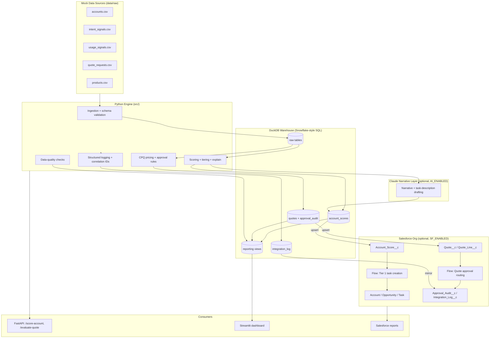
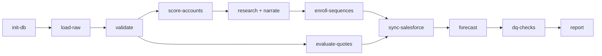
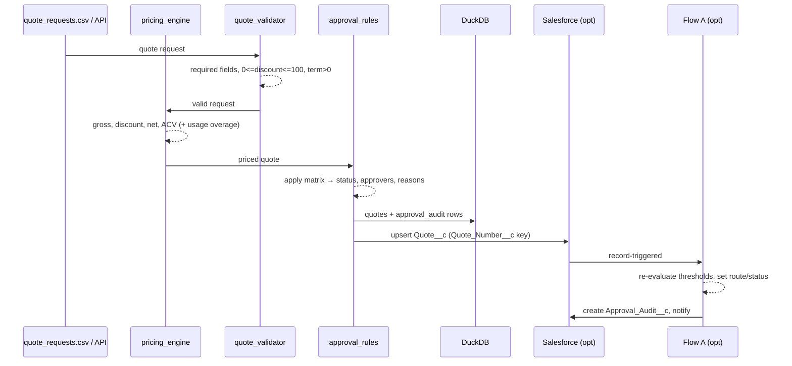
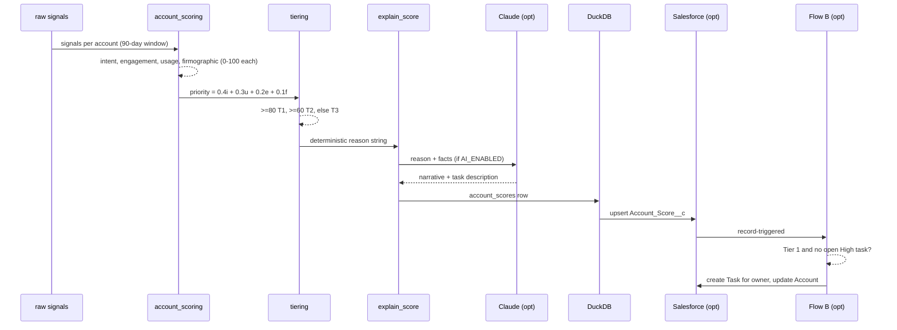
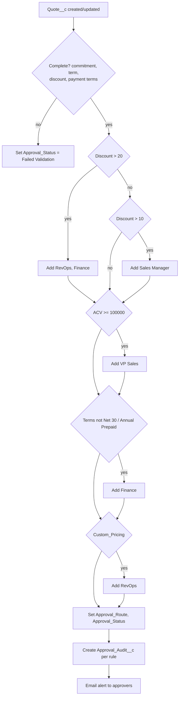
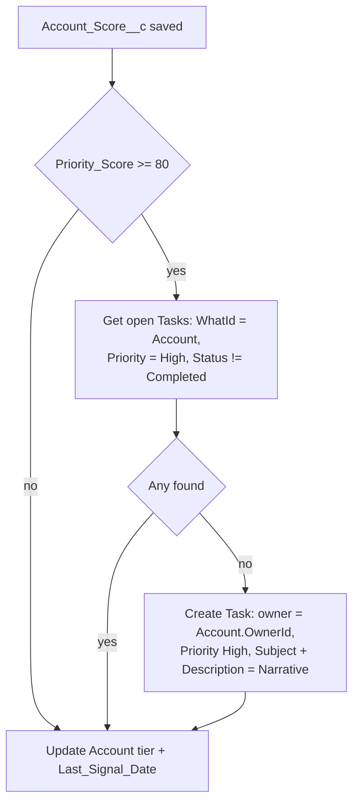

# AI-Native GTM Revenue Operations Engine — Technical Design

**Subtitle:** Salesforce CPQ governance, signal-based account prioritization, CRM data-quality controls, and Snowflake-style revenue reporting.

| | |
|---|---|
| Version | 1.1 (adds HubSpot, agentic research, opportunities, forecasting, sequences) |
| Date | 2026-09-19 |
| Status | Approved for build |

---

## Table of contents

1. [Overview](#1-overview)
2. [Decisions locked in](#2-decisions-locked-in)
3. [High-level architecture](#3-high-level-architecture)
4. [HLD: end-to-end flows](#4-hld-end-to-end-flows)
5. [Repository structure](#5-repository-structure)
6. [LLD: data model](#6-lld-data-model)
7. [LLD: CPQ pricing and approval engine](#7-lld-cpq-pricing-and-approval-engine)
8. [LLD: account scoring and explainability](#8-lld-account-scoring-and-explainability)
9. [LLD: Salesforce integration layer, SFDX metadata, Flows](#9-lld-salesforce-integration-layer-sfdx-metadata-flows)
10. [LLD: Claude narrative layer (optional)](#10-lld-claude-narrative-layer-optional)
11. [LLD: API, dashboard, data quality, monitoring](#11-lld-api-dashboard-data-quality-monitoring)
12. [Demo scenarios](#12-demo-scenarios)
13. [Build plan, testing, open questions](#13-build-plan-testing-open-questions)

---

## 1. Overview

A personal reference implementation of a Salesforce-centered GTM automation engine. It runs end-to-end on a laptop with **no credentials**, and pushes into a real Salesforce org when one is configured. Two connected capabilities share one data layer.

| Capability | What it does | Output |
|---|---|---|
| **CPQ approval governance** | Prices quotes (subscription + usage-based), validates discounts, routes approvals via an explainable rule matrix, writes an audit trail | Approval decision, audit record, quote status |
| **Account signal prioritization** | Ingests firmographic, intent, engagement and usage signals, computes a weighted priority score, tiers accounts, explains the score, creates sales tasks for Tier 1 | Account score record, Salesforce task, narrative |
| **Agentic account research** | For Tier 1 accounts, a Claude tool loop reads enrichment, signals and open quotes, then writes a research brief and a first-touch outbound draft. Tier 2 accounts are enrolled in an outbound sequence | Research brief, outbound draft, sequence enrollment |
| **Revenue reporting and forecasting** | Simulated opportunities with stage history feed a conversion funnel, conversion by tier, stage drop-off (bottleneck) view and a weighted pipeline forecast | Funnel, bottleneck chart, forecast vs actual |
| **Shared foundation** | DuckDB warehouse with Snowflake-style SQL, data-quality checks, structured integration logging, Streamlit reporting, FastAPI service | Dashboards, quality reports, integration log |

**Design principles**

- Business rules are deterministic and explainable. AI never decides; it narrates.
- Every external dependency (Salesforce, Claude) is optional and env-var gated.
- One source of truth for policy thresholds (`src/config.py`), mirrored in SQL and in the Salesforce Flows.
- Every automation run is traceable end-to-end via a `correlation_id`.

---

## 2. Decisions locked in

| Topic | Decision | Reason |
|---|---|---|
| Location | Local git repo `~/gtm-automation-reference`; publish to GitHub later | Resume-ready README, diagram, demo script, screenshot placeholders included |
| Warehouse | DuckDB file `data/gtm.duckdb`; SQL Snowflake-compatible where practical | Zero setup; ports to Snowflake with minimal edits |
| Containers | No `docker-compose` | Nothing needs it |
| Salesforce | Optional integration layer. `SF_ENABLED=true` swaps `MockSalesforceClient` for `simple-salesforce` | Full demo offline; real org one env change away |
| SF metadata | Deployable SFDX source in `sfdx/`: custom objects/fields, permission set, two record-triggered Flows, setup docs | One-command deploy to a Developer Org |
| Dashboard | Streamlit, reads DuckDB only | Runs without an org |
| API | FastAPI, exactly two endpoints: `POST /score-account`, `POST /evaluate-quote` | Service story, minimal surface |
| AI layer | Deterministic core. Optional Claude (`AI_ENABLED=true`) writes the prioritization narrative and drafts the task description; deterministic template otherwise | Trustworthy numbers, better prose |
| Mock data | ~200 accounts, ~2,000 signals, 50 quote requests, `RANDOM_SEED=42`, three demo records seeded explicitly | Reproducible demo |
| Scenario 1 fix | Alpha AI commitment $10,000 → **$5,000**/month. ACV = $57,000, under the $100,000 VP threshold | Keeps the approval matrix as written |
| Tooling | Python 3.11, `requirements.txt`, `pytest`, no Poetry | Simple |
| HubSpot source | HubSpot is the marketing signal source (email engagement, form fills, page views). Local mode reads a HubSpot-shaped CSV export; `HUBSPOT_ENABLED=true` pulls from the HubSpot CRM API with a private-app token | Makes "Salesforce + HubSpot + Snowflake" literally true |
| Agentic research | When `AI_ENABLED=true`, Claude runs a bounded tool loop per Tier 1 account (max 6 tool calls) and returns a research brief + outbound draft. Off, a deterministic template brief is produced. Scoring is never delegated to the model | "Replace manual account research" without giving up explainability |
| Opportunities | Mock generator creates opportunities with stage history and outcomes correlated to tier | Enables funnel, conversion by tier and bottleneck analysis |
| Forecast | Weighted pipeline forecast in SQL (`amount × stage probability`, by close month and tier) plus forecast-vs-actual on closed months | Gives "revenue forecasting" a concrete artifact |
| Sequences | Tier 2 accounts get a `sequence_enrollments` row (mock outbound sequence) instead of only a task; Tier 1 gets both | "Outbound volume by tier" becomes a metric |
| Clay enrichment | Clay is the enrichment source for firmographics and intent. Local mode reads a Clay-shaped CSV export (`data/raw/clay_enrichment.csv`). `CLAY_ENABLED=true` adds a webhook receiver `POST /webhooks/clay` that accepts Clay's "Send to HTTP API" payload and writes to the same table | Mirrors the real Clay → CRM pattern without needing a Clay account |

---

## 3. High-level architecture


_Source: `docs/architecture.svg`. Numbered 1→8 in the order data moves; dashed purple = optional, env-var gated._



ASCII version (for terminals and the README):

```
   ┌──────────────────────────┐
   │   Mock Data Sources       │  CSV: accounts, intent/usage signals,
   │   data/raw/*.csv          │  quote requests, products
   └────────────┬─────────────┘
                v
   ┌──────────────────────────┐
   │  Python Engine  (src/)    │  ingestion → validation → scoring
   │  + FastAPI (api/)         │  CPQ pricing → approval routing
   └──────┬──────────┬────────┘  data-quality → structured logging
          │          │
          v          v
 ┌────────────────┐  ┌───────────────────────────┐
 │ DuckDB          │  │ Salesforce Org (optional)  │
 │ raw / scores /  │  │ Account, Task, Quote__c,    │
 │ quotes / audit  │  │ Account_Score__c,           │
 │ integration_log │  │ Approval_Audit__c,          │
 └───────┬─────────┘  │ Integration_Log__c          │
         │            │ Flow A: approval routing    │
         v            │ Flow B: Tier-1 task         │
 ┌────────────────┐   └───────────────────────────┘
 │ SQL views       │
 │ tiering, trends │        Claude (optional): narrative +
 │ DQ checks       │        task description, AI_ENABLED=true
 └───────┬─────────┘
         v
 ┌────────────────┐
 │ Streamlit       │  CPQ ops · GTM prioritization · Data quality
 └────────────────┘
```

### Component responsibilities

| Component | Responsibility | Depends on |
|---|---|---|
| `src/ingestion` | Load CSVs, enforce schema (pydantic), dedupe, write raw tables | DuckDB |
| `src/ingestion/enrich.py` | Clay enrichment adapter: CSV export reader (default) or webhook payload normalizer; maps Clay columns to `account_enrichment` | DuckDB |
| `src/ingestion/hubspot.py` | HubSpot adapter: CSV export reader (default) or CRM API pull; maps engagement events into `intent_signals` with `signal_source = hubspot` | DuckDB |
| `src/ai/research_agent.py` | Claude tool loop: `get_account`, `get_enrichment`, `get_signals`, `get_open_quotes`, `get_opportunities`; returns brief + outbound draft; template fallback | DuckDB, env vars |
| `src/outbound/sequences.py` | Enrolls Tier 1/2 accounts in mock sequences, dedupes active enrollments | DuckDB |
| `src/forecasting/pipeline_forecast.py` | Runs `06_forecast.sql`, writes `forecast_snapshots` | DuckDB |
| `src/scoring` | Sub-scores → weighted priority → tier → deterministic explanation | raw tables |
| `src/cpq` | Pricing math, quote validation, approval routing | products, quote_requests |
| `src/salesforce` | `SalesforceClient` protocol, mock + real implementations, upserts | env vars |
| `src/ai` | Narrative + task description; template fallback | env vars |
| `src/monitoring` | JSON logs, correlation IDs, integration_log writer, DQ runner, alert summary | DuckDB |
| `sql/` | DDL, loads, scoring SQL, DQ SQL, reporting views | DuckDB |
| `api/` | FastAPI wrapper over cpq + scoring | src |
| `dashboard/` | Streamlit, three tabs, reads views only | DuckDB |
| `sfdx/` | Objects, fields, permission set, two Flows | Salesforce CLI |

---

## 4. HLD: end-to-end flows

### 4.1 Pipeline orchestration (`python -m src.main run-all`)



Each stage writes an `integration_log` row with `STARTED → SUCCESS | FAILED_*` and a shared `correlation_id`. Stages are idempotent: re-running upserts by natural key.

### 4.2 CPQ approval flow



### 4.3 Account prioritization flow



### 4.4 Runtime modes

| Mode | `SF_ENABLED` | `AI_ENABLED` | `CLAY_ENABLED` | `HUBSPOT_ENABLED` | Behavior |
|---|---|---|---|---|---|
| Local demo (default) | false | false | false | false | Mock SF client writes to `data/processed/mock_salesforce.json`; template narratives and briefs; Clay and HubSpot CSV exports |
| Local + AI | false | true | false | false | Same, plus Claude research briefs, outbound drafts and narratives |
| Integrated | true | false/true | false/true | false/true | Real org via `simple-salesforce`; Flows fire in org; Clay pushes to the webhook; HubSpot pulled via API |

---

## 5. Repository structure

```
gtm-automation-reference/
├── README.md
├── requirements.txt
├── .env.example
├── pytest.ini
├── data/
│   ├── raw/                     accounts, intent_signals, usage_signals, quote_requests, products,
│   │                            clay_enrichment, hubspot_engagement, opportunities,
│   │                            opportunity_stage_history (.csv)
│   ├── processed/               enriched_accounts, scored_accounts, approval_decisions, mock_salesforce.json
│   └── gtm.duckdb               (generated, git-ignored)
├── sql/
│   ├── 01_create_tables.sql
│   ├── 02_load_raw_data.sql
│   ├── 03_account_scoring.sql
│   ├── 04_data_quality_checks.sql
│   ├── 05_reporting_views.sql
│   ├── 06_forecast.sql          stage probabilities, weighted pipeline, forecast vs actual
│   └── 07_funnel.sql            stage conversion, drop-off, cycle time by tier
├── src/
│   ├── config.py                settings + policy constants (single source of truth)
│   ├── main.py                  CLI: init-db | load-raw | score | evaluate | sync | dq | run-all | demo
│   ├── db.py                    DuckDB connection + SQL runner
│   ├── ingestion/               load_accounts.py, load_signals.py, validate_schema.py,
│   │                            enrich.py (Clay adapter), hubspot.py (HubSpot adapter), load_opportunities.py
│   ├── scoring/                 account_scoring.py, tiering.py, explain_score.py
│   ├── cpq/                     pricing_engine.py, approval_rules.py, quote_validator.py
│   ├── salesforce/              client.py (protocol + mock + real), upsert_accounts.py,
│   │                            upsert_scores.py, create_tasks.py, create_quotes.py, log_events.py
│   ├── ai/                      narrator.py (narrative + task description), research_agent.py (tool loop),
│   │                            tools.py (read-only DuckDB tools), prompts.py
│   ├── outbound/                sequences.py (Tier 1/2 enrollment, dedupe)
│   ├── forecasting/             pipeline_forecast.py
│   └── monitoring/              logger.py, quality_checks.py, alerts.py
├── api/
│   ├── app.py
│   ├── models.py
│   └── routes/                  health.py, score_account.py, evaluate_quote.py, clay_webhook.py (CLAY_ENABLED only)
├── dashboard/
│   └── app.py                   Streamlit: CPQ ops · GTM prioritization · Pipeline & forecast · Data quality
├── scripts/
│   └── generate_mock_data.py    seeded generator for data/raw
├── sfdx/
│   ├── sfdx-project.json
│   ├── README.md                deploy steps
│   └── force-app/main/default/
│       ├── objects/             Quote__c, Quote_Line__c, Account_Score__c, Approval_Audit__c,
│       │                        Discount_Exception__c, Integration_Log__c (+ fields)
│       ├── flows/               Quote_Approval_Routing.flow-meta.xml, Tier1_Task_Creation.flow-meta.xml
│       └── permissionsets/      GTM_Automation.permissionset-meta.xml
├── tests/
│   ├── test_pricing_engine.py, test_approval_rules.py, test_quote_validator.py
│   ├── test_account_scoring.py, test_tiering.py, test_explain_score.py
│   ├── test_data_quality.py, test_api.py, test_mock_salesforce.py, test_demo_scenarios.py
│   ├── test_sequences.py, test_forecast.py, test_research_agent.py (template path + mocked Claude)
└── docs/
    ├── TECHNICAL_DESIGN.md      (this file)
    ├── architecture.md
    ├── data_dictionary.md
    ├── approval_matrix.md
    ├── salesforce_mapping.md
    ├── salesforce_setup.md
    ├── demo_script.md
    └── screenshots/             placeholders
```

---

## 6. LLD: data model

### 6.1 DuckDB tables (`sql/01_create_tables.sql`)

**accounts**

| Column | Type | Notes |
|---|---|---|
| account_id | VARCHAR PK | `ACC-00001` |
| account_name | VARCHAR NOT NULL | |
| domain | VARCHAR | nullable to exercise DQ check |
| industry | VARCHAR | |
| employee_count | INTEGER | |
| funding_stage | VARCHAR | Seed, Series A–D, Public |
| account_owner | VARCHAR | nullable to exercise DQ check |
| sf_account_id | VARCHAR | populated after sync |
| created_at, updated_at | TIMESTAMP | |

**intent_signals**

| Column | Type | Notes |
|---|---|---|
| signal_id | VARCHAR PK | |
| account_id | VARCHAR FK | |
| signal_type | VARCHAR | see enum below |
| signal_value | DECIMAL(10,2) | count, % growth, or 0/1 |
| signal_source | VARCHAR | web_analytics, clay_enrichment, product_telemetry, email_platform, job_boards, news_feed |
| signal_timestamp | TIMESTAMP | |

Signal types: `website_visit`, `pricing_page_visit`, `demo_request`, `job_posting_ml_engineer`, `funding_event`, `product_usage_growth`, `email_engagement`, `open_source_model_interest`.

**account_enrichment** (Clay-shaped)

| Column | Type | Notes |
|---|---|---|
| enrichment_id | VARCHAR PK | |
| account_id | VARCHAR FK | matched by domain |
| domain | VARCHAR | Clay join key |
| employee_count | INTEGER | Clay: headcount |
| funding_stage | VARCHAR | Clay: last funding round |
| funding_amount_usd | DECIMAL | |
| tech_stack | VARCHAR | comma list, e.g. `python,pytorch,aws` |
| open_ml_roles | INTEGER | Clay: job-board enrichment |
| linkedin_followers | INTEGER | |
| enrichment_source | VARCHAR | `clay_csv` or `clay_webhook` |
| enriched_at | TIMESTAMP | |

Feeds the firmographic sub-score and the `job_posting_ml_engineer` / `funding_event` intent signals. Missing enrichment rows are a data-quality warning.

**hubspot_engagement** (HubSpot-shaped, normalized into `intent_signals` with `signal_source = hubspot`)

| Column | Type | Notes |
|---|---|---|
| event_id | VARCHAR PK | |
| contact_email | VARCHAR | |
| domain | VARCHAR | join key to accounts |
| event_type | VARCHAR | email_open, email_click, form_submit, page_view, meeting_booked |
| event_timestamp | TIMESTAMP | |
| campaign | VARCHAR | |

Mapping: email_open/click → `email_engagement`; form_submit → `demo_request` when the form is "Contact sales", else `website_visit`; page_view on /pricing → `pricing_page_visit`; meeting_booked → `demo_request`.

**opportunities**

| Column | Type | Notes |
|---|---|---|
| opportunity_id | VARCHAR PK | `OPP-00001` |
| account_id | VARCHAR FK | |
| name | VARCHAR | |
| amount | DECIMAL | ACV |
| stage | VARCHAR | Prospecting, Discovery, Proposal, Negotiation, Closed Won, Closed Lost |
| created_at | DATE | |
| close_date | DATE | expected or actual |
| is_closed, is_won | BOOLEAN | |
| source_tier | VARCHAR | account tier at creation (for conversion by tier) |
| sf_opportunity_id | VARCHAR | populated after sync |

**opportunity_stage_history**

| Column | Type |
|---|---|
| history_id | VARCHAR PK |
| opportunity_id | VARCHAR FK |
| from_stage, to_stage | VARCHAR |
| changed_at | TIMESTAMP |
| days_in_from_stage | INTEGER |

Generator rules: win rate and cycle time are correlated with `source_tier` (Tier 1 ≈ 45% win, Tier 2 ≈ 25%, Tier 3 ≈ 10%) so conversion-by-tier is visibly different. A deliberate bottleneck is seeded at Proposal → Negotiation so the dashboard has something to find.

**sequence_enrollments**

| Column | Type | Notes |
|---|---|---|
| enrollment_id | VARCHAR PK | |
| account_id | VARCHAR FK | |
| sequence_name | VARCHAR | `tier1_exec_outreach`, `tier2_outbound` |
| enrolled_at | TIMESTAMP | |
| status | VARCHAR | active, replied, completed, paused |
| first_touch_draft | VARCHAR | from research agent or template |
| correlation_id | VARCHAR | |

One active enrollment per account per sequence (dedupe).

**account_research**

| Column | Type | Notes |
|---|---|---|
| research_id | VARCHAR PK | |
| account_id | VARCHAR FK | |
| brief | VARCHAR | 5–8 sentence research brief |
| outbound_draft | VARCHAR | first-touch email |
| talking_points | VARCHAR | JSON list |
| source | VARCHAR | template / claude |
| tool_calls | INTEGER | how many tools the agent used |
| researched_at | TIMESTAMP | |

**forecast_snapshots**

| Column | Type |
|---|---|
| snapshot_id | VARCHAR PK |
| snapshot_date | DATE |
| close_month | DATE |
| account_tier | VARCHAR |
| open_pipeline | DECIMAL |
| weighted_forecast | DECIMAL |
| closed_won_actual | DECIMAL |

**usage_signals**

| Column | Type |
|---|---|
| usage_id | VARCHAR PK |
| account_id | VARCHAR FK |
| month | DATE |
| api_calls | BIGINT |
| active_users | INTEGER |
| mom_growth_pct | DECIMAL(6,2) |

**products**

| Column | Type | Sample |
|---|---|---|
| product_id | VARCHAR PK | PRD-API-BASE |
| product_name | VARCHAR | Base API Commitment |
| pricing_model | VARCHAR | subscription / usage |
| list_price_monthly | DECIMAL | 10000 |
| included_units | BIGINT | 10,000,000 |
| overage_price_per_unit | DECIMAL(12,8) | 0.0000012 |

Seeded products: Base API Commitment ($10,000/mo, 10M units, $0.0000012 overage), Premium Support ($2,000/mo), Enterprise Platform ($50,000/mo).

**quote_requests / quotes**

| Column | Type | Notes |
|---|---|---|
| quote_id | VARCHAR PK | `Q-00001` |
| account_id | VARCHAR FK | |
| product_id | VARCHAR FK | |
| monthly_commitment | DECIMAL | |
| quantity | INTEGER | |
| contract_term_months | INTEGER | |
| discount_percent | DECIMAL(5,2) | |
| payment_terms | VARCHAR | Net 30, Net 60, Net 90, Annual Prepaid |
| custom_pricing | BOOLEAN | |
| forecasted_units | BIGINT | usage products |
| custom_overage_rate | DECIMAL(12,8) | nullable |
| gross_contract_value, discount_amount, net_contract_value, annual_contract_value | DECIMAL | computed |
| approval_status | VARCHAR | Auto-Approved / Pending Approval / Approved / Rejected / Failed Validation |
| approval_route | VARCHAR | comma-joined approvers |
| exception_reason | VARCHAR | |
| created_at, evaluated_at | TIMESTAMP | |

**approval_audit**

| Column | Type |
|---|---|
| audit_id | VARCHAR PK |
| quote_id | VARCHAR FK |
| rule_triggered | VARCHAR |
| requested_discount | DECIMAL(5,2) |
| required_approver | VARCHAR |
| decision | VARCHAR |
| decision_reason | VARCHAR |
| decision_timestamp | TIMESTAMP |
| approver | VARCHAR |
| correlation_id | VARCHAR |

One audit row per rule triggered (Scenario 2 produces four rows).

**account_scores**

| Column | Type |
|---|---|
| score_id | VARCHAR PK |
| account_id | VARCHAR FK |
| intent_score, engagement_score, firmographic_fit_score, usage_score | DECIMAL(5,2) |
| priority_score | DECIMAL(5,2) |
| account_tier | VARCHAR |
| scoring_reason | VARCHAR (deterministic) |
| narrative | VARCHAR (template or Claude) |
| narrative_source | VARCHAR (template / claude) |
| scored_at | TIMESTAMP |
| correlation_id | VARCHAR |

**sales_tasks**

| Column | Type |
|---|---|
| task_id | VARCHAR PK |
| account_id | VARCHAR FK |
| owner | VARCHAR |
| subject, description | VARCHAR |
| priority | VARCHAR |
| status | VARCHAR |
| sf_task_id | VARCHAR |
| created_at | TIMESTAMP |

**integration_log**

| Column | Type |
|---|---|
| log_id | VARCHAR PK |
| workflow_name | VARCHAR |
| record_type, record_id | VARCHAR |
| status | VARCHAR: STARTED, SUCCESS, FAILED_VALIDATION, FAILED_API, RETRYING, RECONCILED |
| started_at, completed_at | TIMESTAMP |
| error_message | VARCHAR |
| retry_count | INTEGER |
| correlation_id | VARCHAR |

### 6.2 Salesforce object mapping

| Business entity | Salesforce object | Key field |
|---|---|---|
| Customer | Account (standard) | `External_Account_Id__c` (text, external ID, unique) |
| Sales deal | Opportunity (standard) | `External_Opportunity_Id__c` (external ID); StageName, Amount, CloseDate mapped |
| Quote | `Quote__c` (custom) | `Quote_Number__c` (external ID) |
| Quote line | `Quote_Line__c` | |
| Product | Product2 + PricebookEntry (standard) | |
| Discount exception | `Discount_Exception__c` | |
| Account score | `Account_Score__c` | `Score_Id__c` (external ID) |
| Approval/audit event | `Approval_Audit__c` | `Audit_Id__c` (external ID) |
| Sales task | Task (standard) | |
| Integration log | `Integration_Log__c` | `Correlation_Id__c` |

**Quote__c fields:** Quote_Number__c, Account__c (lookup), Opportunity__c (lookup), Product__c (lookup Product2), Monthly_Commitment__c, List_Price__c, Quantity__c, Contract_Term_Months__c, Discount_Percent__c, Discount_Amount__c, Net_Price__c, Annual_Contract_Value__c, Payment_Terms__c (picklist), Custom_Pricing__c (checkbox), Approval_Status__c (picklist), Approval_Route__c, Exception_Reason__c (long text).

**Account_Score__c fields:** Score_Id__c, Account__c, Intent_Score__c, Engagement_Score__c, Firmographic_Fit_Score__c, Usage_Score__c, Priority_Score__c, Account_Tier__c (picklist), Scoring_Reason__c (long text), Narrative__c (long text), Scored_At__c.

**Approval_Audit__c fields:** Audit_Id__c, Quote__c (master-detail), Rule_Triggered__c, Requested_Discount__c, Required_Approver__c, Decision__c (picklist), Decision_Reason__c, Decision_Timestamp__c, Approver__c, Correlation_Id__c.

**Account (standard) added fields:** External_Account_Id__c, Account_Tier__c, Last_Signal_Date__c, Priority_Score__c.

---

## 7. LLD: CPQ pricing and approval engine

### 7.1 Policy constants (`src/config.py`)

```python
STANDARD_DISCOUNT_LIMIT = 10.0     # <= 10% no approval
MANAGER_DISCOUNT_LIMIT  = 20.0     # 10 < d <= 20 Sales Manager; > 20 RevOps + Finance
VP_ACV_THRESHOLD        = 100_000  # ACV >= 100K VP Sales
STANDARD_PAYMENT_TERMS  = ("Net 30", "Annual Prepaid")
```

### 7.2 Pricing engine (`src/cpq/pricing_engine.py`)

```python
def calculate_quote(list_price, quantity, discount_percent, contract_term_months) -> QuoteEconomics:
    gross  = list_price * quantity * contract_term_months
    disc   = gross * discount_percent / 100
    net    = gross - disc
    acv    = net * (12 / contract_term_months)
    return QuoteEconomics(gross, disc, net, acv)      # all rounded to 2dp

def calculate_usage_pricing(monthly_commitment, included_units, forecasted_units,
                            overage_price_per_unit, term_months) -> UsageEconomics:
    overage_units   = max(forecasted_units - included_units, 0)
    monthly_overage = overage_units * overage_price_per_unit
    monthly_total   = monthly_commitment + monthly_overage
    tcv             = monthly_total * term_months
    return UsageEconomics(overage_units, monthly_overage, monthly_total, tcv)
```

`price_quote(request, product)` composes both: for usage products the monthly total (commitment + overage) becomes the effective list price before discount.

### 7.3 Quote validator (`src/cpq/quote_validator.py`)

Rejects with `FAILED_VALIDATION` when: required field missing; `discount_percent` outside 0–100; `contract_term_months <= 0`; `monthly_commitment <= 0`; unknown product; `payment_terms` not in the allowed picklist. Validation failures are logged, never routed.

### 7.4 Approval rules (`src/cpq/approval_rules.py`)

```python
def determine_approval_route(discount_percent, acv, payment_terms, custom_pricing) -> ApprovalDecision:
    rules = []   # (rule_name, approver, reason)
    if discount_percent > 20:
        rules += [("DISCOUNT_GT_20", "RevOps", "Discount exceeds 20%"),
                  ("DISCOUNT_GT_20", "Finance", "Discount exceeds 20%")]
    elif discount_percent > 10:
        rules += [("DISCOUNT_GT_10", "Sales Manager", "Discount exceeds standard 10% threshold")]
    if acv >= 100_000:
        rules += [("ACV_GTE_100K", "VP Sales", "ACV exceeds $100,000")]
    if payment_terms not in STANDARD_PAYMENT_TERMS:
        rules += [("NONSTANDARD_TERMS", "Finance", "Nonstandard payment terms")]
    if custom_pricing:
        rules += [("CUSTOM_PRICING", "RevOps", "Custom product or pricing structure")]
    if not rules:
        return ApprovalDecision("Auto-Approved", [], ["Quote meets standard commercial policy"], [])
    return ApprovalDecision("Pending Approval", ordered_unique(approvers), reasons, rules)
```

Approver order is deterministic (Sales Manager → RevOps → Finance → VP Sales) so `Approval_Route__c` is stable.

**Approval matrix**

| Rule | Route |
|---|---|
| Discount 0–10%, standard terms, ACV < $100K | Auto-approve |
| Discount 10–20% | Sales Manager |
| Discount > 20% | RevOps + Finance |
| ACV ≥ $100K | VP Sales |
| Custom pricing / custom overage rate | RevOps |
| Nonstandard payment terms | Finance |

---

## 8. LLD: account scoring and explainability

### 8.1 Sub-scores (`src/scoring/account_scoring.py`), 90-day window, each clamped 0–100

| Sub-score | Inputs | Formula |
|---|---|---|
| intent | pricing_page_visit, demo_request, job_posting_ml_engineer, funding_event, open_source_model_interest | weighted counts: demo 40, pricing 15/visit (cap 45), job posting 10, funding 15, OSS interest 10 |
| engagement | website_visit, email_engagement | website 2/visit (cap 50) + email 10/engagement (cap 50) |
| usage | latest `mom_growth_pct`, active_users | growth: `min(growth_pct, 50) * 1.6` (cap 80) + users: `min(active_users/10, 20)` |
| firmographic | industry, employee_count, funding_stage | industry match 40 (AI/ML/SaaS/Fintech), size band 30 (50–2,000 best), stage 30 (Series A–C best) |

### 8.2 Priority and tier

```python
priority = round(0.40*intent + 0.30*usage + 0.20*engagement + 0.10*firmographic, 2)
tier     = "Tier 1" if priority >= 80 else "Tier 2" if priority >= 60 else "Tier 3"
```

| Tier | Action |
|---|---|
| Tier 1 (≥ 80) | Research agent runs → brief + outbound draft; create Salesforce Task (High, dedupe on open High tasks); enroll in `tier1_exec_outreach` |
| Tier 2 (60–79) | Template brief; enroll in `tier2_outbound` sequence (dedupe on active enrollment); no task |
| Tier 3 (< 60) | Nurture, no action |

### 8.3 Explainability (`src/scoring/explain_score.py`)

Deterministic template built from the top contributing facts, e.g.

> Tier 1 because product usage grew 40% month-over-month, the account visited pricing pages three times and requested a demo, and firmographic fit is high (Series B AI company, 320 employees).

Stored in `scoring_reason`. The Claude layer (§10) may expand it into `narrative`; `scoring_reason` is never overwritten.

---

## 9. LLD: Salesforce integration layer, SFDX metadata, Flows

### 9.1 Client abstraction (`src/salesforce/client.py`)

```python
class SalesforceClient(Protocol):
    def upsert(self, sobject: str, external_id_field: str, external_id: str, data: dict) -> str: ...
    def create(self, sobject: str, data: dict) -> str: ...
    def query(self, soql: str) -> list[dict]: ...

class MockSalesforceClient:      # default; persists to data/processed/mock_salesforce.json
class RealSalesforceClient:      # wraps simple_salesforce.Salesforce; used when SF_ENABLED=true

def get_client() -> SalesforceClient   # env-var switch, single entry point
```

Both implement identical semantics (upsert by external ID, query returning dicts) so tests run against the mock and integration code is unchanged in production. The mock also answers the dedupe SOQL used before task creation.

### 9.2 Sync operations

| Module | Operation | Idempotency key |
|---|---|---|
| upsert_accounts.py | Account | External_Account_Id__c |
| upsert_scores.py | Account_Score__c | Score_Id__c |
| create_quotes.py | Quote__c + Approval_Audit__c | Quote_Number__c / Audit_Id__c |
| create_tasks.py | Task (Tier 1 only, dedupe: open High task on same Account) | SOQL check |
| log_events.py | Integration_Log__c | Correlation_Id__c + workflow |

Every call wraps in `try/except`, writes `integration_log` (SUCCESS / FAILED_API), retries up to 3 times with backoff, then marks `RETRYING` → `FAILED_API`.

### 9.3 SFDX package (`sfdx/`)

- `sfdx-project.json` (API version 61.0)
- Objects: `Quote__c`, `Quote_Line__c`, `Account_Score__c`, `Approval_Audit__c`, `Discount_Exception__c`, `Integration_Log__c`, plus custom fields on `Account`
- Permission set `GTM_Automation` granting CRUD + FLS on all custom objects/fields
- Flows: `Quote_Approval_Routing` and `Tier1_Task_Creation`
- `sfdx/README.md` + `docs/salesforce_setup.md`: authorize org, deploy, assign permission set, verify

Deploy:

```bash
sf org login web -a gtm-dev
sf project deploy start -d sfdx/force-app -o gtm-dev
sf org assign permset -n GTM_Automation -o gtm-dev
```

### 9.4 Flow A: Quote_Approval_Routing (record-triggered, Quote__c, after create/update)



Entry condition: `Approval_Status__c` is blank or "Draft" (prevents re-fire after the Python service sets status).

### 9.5 Flow B: Tier1_Task_Creation (record-triggered, Account_Score__c, after create/update)



---

## 10. LLD: Claude agentic research and narrative layer (optional)

Two uses of Claude, both behind `AI_ENABLED`, both with deterministic fallbacks. Neither can change a score, tier, price or approval decision.

### 10.1 Narrator (`src/ai/narrator.py`)

Turns the deterministic `scoring_reason` and facts into a prioritization narrative and a task description. JSON output validated by pydantic; on any error the template is used. Unchanged from v1.0.

### 10.2 Research agent (`src/ai/research_agent.py`)

Runs once per Tier 1 account (and on demand from the API). A bounded tool loop with read-only tools over DuckDB:

| Tool | Returns |
|---|---|
| `get_account(account_id)` | firmographics, owner, tier, priority score, scoring reason |
| `get_enrichment(account_id)` | Clay row: funding, headcount, tech stack, open ML roles |
| `get_signals(account_id, days=90)` | intent + usage signals, incl. HubSpot-sourced events |
| `get_open_quotes(account_id)` | quotes and approval status |
| `get_opportunities(account_id)` | open/closed opportunities with stages |

```python
def research_account(account_id) -> AccountResearch:
    if not settings.ai_enabled:
        return template_research(account_id)              # deterministic, always available
    messages = [user_prompt(account_id)]
    for _ in range(MAX_TOOL_CALLS):                       # MAX_TOOL_CALLS = 6
        resp = client.messages.create(model=settings.anthropic_model, system=SYSTEM_PROMPT,
                                      tools=TOOLS, messages=messages, temperature=0, max_tokens=1500)
        if resp.stop_reason != "tool_use":
            break
        messages += execute_tools(resp)                   # read-only DuckDB calls, each logged
    return parse_or_fallback(resp, account_id)            # pydantic: brief, outbound_draft, talking_points
```

Guardrails: tools are read-only, max 6 calls, 20-second budget, output validated, every tool call written to `integration_log` with the run's correlation ID. `account_research.source` records `template` or `claude`, and `tool_calls` records how many tools were used.

Template fallback produces the same three fields from the scoring reason, enrichment row and top three signals, so the dashboard and sequences behave identically with the AI off.

### 10.3 Cost control

Tier 1 only (typically 10–20 accounts of 200). Tier 2 and 3 never call the model. A `--limit` flag caps calls per run.

## 11. LLD: API, dashboard, data quality, monitoring

### 11.1 FastAPI (`api/`)

| Endpoint | Request | Response |
|---|---|---|
| `GET /health` | | `{status, db_ok, sf_enabled, ai_enabled}` |
| `POST /score-account` | `{account_id?}` or inline `{intent_score, engagement_score, usage_score, firmographic_fit_score, account_name}` | `{priority_score, account_tier, scoring_reason, narrative, action}` |
| `POST /research-account` (AI_ENABLED only) | `{account_id}` | `{brief, outbound_draft, talking_points, source, tool_calls}` |
| `POST /evaluate-quote` | `{account_name, product_id, monthly_commitment, quantity, contract_term_months, discount_percent, payment_terms, custom_pricing, forecasted_units?}` | `{economics{...}, approval{status, approvers, reasons}, audit_rows[]}` |

`POST /webhooks/clay` is registered only when `CLAY_ENABLED=true`: it validates Clay's JSON body (one row per enriched company), normalizes it into `account_enrichment`, and returns `202 Accepted` with the correlation ID. In Clay, this is the "Send to HTTP API" action on the enriched table.

Run: `uvicorn api.app:app --reload`. Pydantic models in `api/models.py` are the public contract.

### 11.2 Streamlit dashboard (`dashboard/app.py`), reads `sql/05_reporting_views.sql` views only

| Tab | Metrics |
|---|---|
| CPQ operations | total quotes, auto-approve rate, pending count, avg approval time, discount histogram, quotes by route, exceptions by reason |
| GTM prioritization | accounts by tier, Tier 1 without task, signal source distribution (Clay / HubSpot / telemetry / web), priority-score trend, tasks by owner, sequence enrollments by tier, research briefs (source mix) |
| Pipeline & forecast | stage funnel with conversion % per step, stage drop-off (bottleneck) bar, conversion by tier, median days in stage, weighted forecast by close month and tier, forecast vs actual on closed months |
| Data quality | accounts missing owner/domain, duplicate domains, invalid discounts, stale pending quotes, failed integration runs, failed validations |

### 11.2a Forecast and funnel SQL

`06_forecast.sql`: stage probability table (Prospecting 10%, Discovery 25%, Proposal 50%, Negotiation 75%, Closed Won 100%), `weighted_pipeline` view = `SUM(amount × probability)` by `close_month`, `account_tier`; `forecast_vs_actual` view joins prior snapshots to closed-won actuals. `07_funnel.sql`: opportunities reaching each stage, step conversion, median `days_in_from_stage`, and the stage with the largest drop-off flagged as `bottleneck = true`.

### 11.3 Data-quality checks (`sql/04_data_quality_checks.sql` + `src/monitoring/quality_checks.py`)

| Check | Severity |
|---|---|
| Accounts without domain | warn |
| Duplicate account domains | error |
| Accounts without owner | error |
| Invalid discount (< 0 or > 100) | error |
| Quotes pending > 2 days | warn |
| Tier 1 accounts without follow-up task | error |
| Scores without an account | error |
| Failed integration runs in last 24h | warn |
| Accounts with signals but no enrichment row | warn |
| Opportunities with no stage history | error |
| Active duplicate sequence enrollments | error |
| Closed-won opportunities missing amount | error |

Runner writes `dq_results` table and prints a summary; exit code 1 if any `error` rows (CI-friendly).

### 11.4 Monitoring and logging (`src/monitoring/logger.py`)

- JSON lines to `logs/gtm_automation.log` and stdout: `ts, level, workflow, record_type, record_id, status, correlation_id, msg, extra`.
- `with workflow_run("score_accounts") as run:` context manager writes STARTED / SUCCESS / FAILED_* rows to `integration_log` and mirrors to `Integration_Log__c` when SF is enabled.
- `alerts.py` summarizes failures and DQ errors into a console alert (Slack/email hook stubbed).

---

## 12. Demo scenarios

Seeded explicitly in `scripts/generate_mock_data.py`; asserted in `tests/test_demo_scenarios.py`; walked through in `docs/demo_script.md`.

| # | Customer | Inputs | Expected |
|---|---|---|---|
| 1 | Alpha AI | $5,000/mo, 12 mo, 5%, Net 30, no custom pricing | Gross $60,000, net $57,000, ACV $57,000 → **Auto-Approved**, 1 audit row "meets standard policy" |
| 2 | EnterpriseGen | $50,000/mo, 12 mo, 25%, Net 60, custom overage | Gross $600,000, net $450,000, ACV $450,000 → **Pending Approval**, route RevOps + Finance + VP Sales, 4 audit rows: Discount > 20%, ACV ≥ $100K, Nonstandard terms, Custom pricing |
| 3 | FastScale AI | intent 90, usage 90, engagement 80, firmographic 84 | Priority **87.0**, Tier 1, task created (dedupe verified), reason + narrative stored, research brief + outbound draft stored, enrolled in `tier1_exec_outreach` |
| 4 | Pipeline view | seeded opportunities across 6 months | Funnel shows Proposal → Negotiation as the bottleneck; Tier 1 win rate visibly higher than Tier 3; forecast table has a value for every open close month |

Scenario 3 arithmetic: 0.4·90 + 0.3·90 + 0.2·80 + 0.1·84 = 36 + 27 + 16 + 8.4 = 87.4 → seeds are tuned so the computed sub-scores land at exactly 87.0 (test asserts `== 87.0`).

Demo command: `python -m src.main demo` prints all three results, then `streamlit run dashboard/app.py`.

---

## 12a. Resume alignment map

| Resume claim | Where it lives in this project |
|---|---|
| AI-native GTM stack integrating Salesforce, HubSpot, Snowflake; centralized data; forecasting | Salesforce sync + Flows, HubSpot adapter, DuckDB with Snowflake-style SQL, `06_forecast.sql`, Pipeline & forecast tab |
| Automated quote-to-cash with Salesforce CPQ, pricing/discount rules, approval latency | Pricing engine, approval matrix, Flow A, approval audit, "average approval time" metric |
| Agentic automation via Clay and Claude replacing manual account research, outbound volume | Clay enrichment, research agent tool loop, outbound drafts, sequence enrollments by tier |
| Signal-based revenue plays on intent/usage triggering outbound | Signal ingestion, weighted scoring, tiering, Flow B tasks, sequences |
| CRM data integrity guardrails | Schema validation, dedupe, quote validator, 13 DQ checks, DQ tab, exit-code gate |
| Real-time reporting in Snowflake/Salesforce to find conversion bottlenecks | Funnel + bottleneck view (`07_funnel.sql`), Salesforce reports, Streamlit |

## 13. Build plan, testing, open questions

### 13.1 Build order

1. Scaffold, config, DuckDB layer, SQL DDL
2. Mock data generator with seeded scenarios
3. CPQ engine + tests
4. Scoring engine + explainability + tests
5. Salesforce client (mock + real) + sync modules + tests
6. Claude narrator + research agent (tools, loop, template fallback)
6a. Sequences module; opportunities + stage history in generator; forecast + funnel SQL
7. Monitoring, DQ checks, alerts
8. FastAPI + tests
9. Streamlit dashboard
10. SFDX metadata + Flows + setup docs
11. README, docs, demo script, screenshot placeholders
12. `run-all` end-to-end, first commit

### 13.2 Testing strategy

| Layer | Tests |
|---|---|
| Unit | pricing math, usage overage, approval matrix boundaries (10, 20, 100K exact), tier boundaries (60, 80), validator rejections |
| Scenario | the three demo records reproduce expected outputs byte-for-byte |
| Integration | mock SF client upsert/dedupe semantics; DQ checks against seeded defects |
| API | httpx TestClient for both endpoints + health |
| Data | schema validation of generated CSVs |

`pytest -q` must pass with no env vars set.

### 13.3 Open questions (none blocking)

- Slack/email notifications in Flow A: email alert only for v1; Slack left as a stub.
- Opportunity linkage: Quote__c has an Opportunity lookup but the pipeline does not create Opportunities in v1.
- HubSpot live mode: v1 pulls contacts + engagement events via the CRM API with a private-app token; webhooks are out of scope.
- Forecast probabilities are static per stage in v1; a historical-win-rate version is a follow-up.
- API surface: the two core endpoints stay. `/webhooks/clay` and `/research-account` are optional routes that only register when their env switch is on.
- Snowflake port: DDL uses `DECIMAL`, `TIMESTAMP`, `CURRENT_TIMESTAMP`, `INTERVAL`; DuckDB-only syntax (e.g. `read_csv_auto`) is isolated in `02_load_raw_data.sql`.
