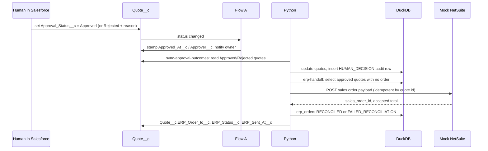

# v2 design addendum

v2 extends the v1 engine without changing its rules: Python still decides, Salesforce still executes CRM actions, Clay and HubSpot stay upstream. Each item below is independent and ships behind the same offline-first defaults as v1.

## Item 1: Quote-to-cash handoff (human approval capture + NetSuite-style ERP handoff)

**Goal.** Close the loop from an approved quote to a finance system. In v1 the engine routes exceptions and Salesforce notifies approvers. In v2 a human records the decision in Salesforce, the engine reads it back, and approved quotes are handed to a mock ERP as a sales order with a billing schedule. The handoff is reconciled and the result is written back to DuckDB and Salesforce.

### Ownership

| Step | Owner | System of record |
|---|---|---|
| Policy decision (Auto-Approved / Pending Approval / Failed Validation) | Python | DuckDB `quotes`, mirrored to `Quote__c` |
| Human approve / reject on a pending quote | A person in Salesforce (or the `decide` CLI as a stand-in) | `Quote__c.Approval_Status__c`, `Approver__c`, `Rejection_Reason__c` |
| Reading the human decision back | Python `sync-approval-outcomes` | DuckDB `quotes` + one `HUMAN_DECISION` audit row |
| Sales-order handoff | Python `erp-handoff` | DuckDB `erp_orders`; ERP returns `sales_order_id` |
| Reconciliation | Python | `erp_orders.status`, `quotes.erp_status`, `Quote__c.ERP_Status__c` |

Approval states that are eligible for handoff: `Auto-Approved` (policy-approved) and `Approved` (human-approved). `Rejected`, `Pending Approval` and `Failed Validation` never reach the ERP.

### Flow



### Sales-order payload (`src/erp/payload.py`)

```json
{
  "external_quote_id": "Q-00002",
  "policy_version": "2026.09",
  "correlation_id": "run-...",
  "customer": {"name": "EnterpriseGen", "external_account_id": "ACC-00002", "salesforce_account_id": "001..."},
  "terms": {"contract_term_months": 12, "payment_terms": "Net 60", "start_date": "2026-10-01"},
  "lines": [
    {"product_id": "PRD-ENT-PLATFORM", "description": "Enterprise Platform", "quantity": 1,
     "monthly_rate": 50000.0, "discount_percent": 25.0, "net_monthly_rate": 37500.0, "term_months": 12, "amount": 450000.0}
  ],
  "usage": {"included_units": 50000000, "forecasted_units": 45000000, "overage_rate": 0.000001, "custom_overage": true},
  "totals": {"gross": 600000.0, "discount": 150000.0, "net": 450000.0, "annual_contract_value": 450000.0},
  "billing_schedule": [{"period": 1, "due_date": "2026-10-01", "amount": 37500.0}, "... one per month ..."]
}
```

The billing schedule is monthly for `Net 30` / `Net 60` / `Net 90` terms and a single up-front line for `Annual Prepaid`. The sum of the schedule always equals `totals.net`; the mock ERP rejects payloads where it does not.

### Mock ERP (`src/erp/netsuite_mock.py`, optional `erp/mock_server.py`)

- `MockNetSuiteClient.create_sales_order(payload) -> {sales_order_id, status, accepted_total}`.
- Validates required fields and the schedule sum; returns `SO-` + a stable id; idempotent by `external_quote_id` (re-sending returns the same order).
- Persists to `data/processed/mock_netsuite.json`.
- `erp/mock_server.py` exposes the same behavior over HTTP (`POST /sales-orders`, `GET /sales-orders/{id}`) on port 8100 so the handoff can run over a network boundary. `ERP_URL` switches the engine from in-process to HTTP; both paths use one client interface. This is the seam a real NetSuite REST integration would replace.

### Reconciliation

After the ERP acknowledges, Python compares `accepted_total` to `quotes.net_contract_value`. Equal → `RECONCILED`. Otherwise `FAILED_RECONCILIATION`, an `integration_log` row with status `FAILED_API`, and a data-quality error. Two new DQ checks: approved quotes older than one day with no ERP order; ERP orders not reconciled.

### Data model additions

| Table / object | Columns |
|---|---|
| `quotes` | `approver`, `decision_at`, `rejection_reason`, `erp_order_id`, `erp_status` (Not Sent / Sent / Reconciled / Failed), `erp_sent_at` |
| `erp_orders` | `order_id` PK, `quote_id`, `sales_order_id`, `status` (SENT / RECONCILED / FAILED_RECONCILIATION), `payload_json`, `accepted_total`, `sent_at`, `reconciled_at`, `correlation_id` |
| `approval_audit` | new rule `HUMAN_DECISION` with `approver` populated |
| `Quote__c` | `Approver__c`, `Rejection_Reason__c`, `ERP_Order_Id__c`, `ERP_Status__c`, `ERP_Sent_At__c` |
| Flow A | `Approved` → stamp `Approved_At__c` and `Approver__c` from LastModifiedBy; `Rejected` → notify Quote Owner |

### CLI and pipeline

- `decide --quote-id Q-00002 --decision Approved --approver "Jane Doe" [--reason ...]` writes the decision to Salesforce (mock or real). It stands in for a person using the UI; in a real org the person just edits the quote.
- `sync-approval-outcomes` and `erp-handoff` are new stages. `run-all` order: ... → sync-salesforce → sync-task-outcomes → sync-approval-outcomes → erp-handoff → dq-checks → report.

### Scenario 4

Approve Q-00002 as "Jane Doe" → `HUMAN_DECISION` audit row → sales order `SO-…` with a 12-line monthly schedule summing to $450,000 → `RECONCILED` → `Quote__c.ERP_Status__c = Reconciled`. Alpha AI (Q-00001, auto-approved) is handed off without a human step. A rejected quote produces no order.

### Out of scope for item 1

Real NetSuite credentials, item/customer master sync, invoice and payment status, credit checks. The mock keeps the payload shape realistic so a real adapter is a drop-in replacement of `MockNetSuiteClient`.
